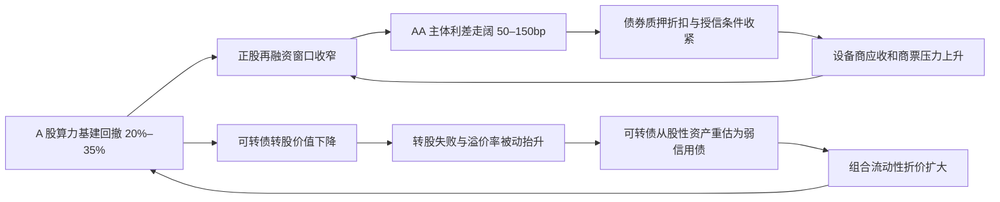

# AI 算力基建产业方向仍成立，但跨资产组合已暴露在同一融资链压力下，必须从主题进攻仓位切换为受控风险预算和尾部对冲。

Analyst: **Chief Risk Officer**
Status: **completed**
Stance: **synthesize**
Completed: **26/04/2026, 19:30:37**

## Links

- Whiteboard topic: [[HBM4 与逻辑底座芯片的深度融合]]
- Card topic: [[AI 算力基建产业方向仍成立，但跨资产组合已暴露在同一融资链压力下，必须从主题进攻仓位切换为受控风险预算和尾部对冲。]]
- Analyst: [[Chief Risk Officer]]
- Analyst level: [[风控与合规]]

## Topic

AI 算力基建产业方向仍成立，但跨资产组合已暴露在同一融资链压力下，必须从主题进攻仓位切换为受控风险预算和尾部对冲。

## Question

Investigate the topic "AI 算力基建产业方向仍成立，但跨资产组合已暴露在同一融资链压力下，必须从主题进攻仓位切换为受控风险预算和尾部对冲。" and make the strongest evidence-based judgment you can.

## Summary

本卡整合 A 股 20%–35% 回撤、AA 利差 50–150bp 走阔和可转债转股失败。基准组合 95% 损失约 13%–15%，99% 约 21%–24%，尾部加流动性折价约 32%–38%。核心风险是股票与转债共同下跌、信用利差确认融资链恶化并推高相关性。建议降股票、降 AA、降失败转债，提高现金和高等级短久期资产，并覆盖权益尾部风险。

## Report

# AI 算力基建跨资产组合压力测试：从主题拥挤收口到尾部风险预算

**分析师**：首席风控官  
**本卡立场**：synthesize  
**数据截止**：2026 年 4 月 26 日  
**承接范围**：卡 4 的 A 股 20%–35% 回撤压力、卡 9 的 AA 级信用利差 50–150bp 走阔压力、可转债转股失败情景  

## 核心结论

我综合支持前序“AI 算力基建方向真实，但交易、融资和信用风险高度分层”的主线，并把结论收口为组合风控判断：本轮风险不是单一资产的线性下跌，而是 A 股主题拥挤、AA 信用利差走阔、可转债转股失败和流动性折价在同一时间窗口内相关性跳升。若以 100 单位的算力基建跨资产组合为基准，配置为股票 50%、AA 信用债 30%、可转债 20%，则 95% 情景损失约为 13%–15%，99% 情景损失约为 21%–24%，极端尾部损失约为 32%–38%。其中 70% 以上的组合尾部损失来自股票和可转债的共同下跌，而不是信用债票息端本身。

因此，组合管理的核心不是简单减仓 AI 算力基建，而是把风险预算从“同一产业链多资产叠加”改成“现金流验证、信用等级、转股安全边际和对冲覆盖”四个维度。建议将基准组合从 **股票 50% / 信用债 30% / 可转债 20%** 调整为 **股票 30%–35% / 高等级短久期信用债 25%–30% / 可转债 8%–10% / 现金与国债类流动性资产 25%–30%**，并用股指期货、行业 ETF 反向头寸、保护性看跌期权或领口策略覆盖剩余权益尾部风险。

## 一、统一压力测试框架

本卡不再重复产业逻辑，而是把卡 4、卡 8、卡 9 已经确认的脆弱点映射为三个风险因子。

| 风险因子 | 前序依据 | 组合损失渠道 | 本卡建模口径 |
|---|---|---|---|
| A 股算力基建股票回撤 | 卡 4 指出估值前置、融资盘拥挤、北向边际配置下降，压力区间为 20%–35% | 正股市值损失、融资盘去杠杆、可转债转股价值坍缩 | 中度 -20%，重度 -30%，尾部 -35% |
| AA 级信用利差走阔 | 卡 9 指出 AA 主体短债滚续、商票池、美元债和再融资压力，利差走阔 50–150bp | 信用债价格下跌、融资成本上升、债券质押折扣扩大 | 久期 2.2 年，叠加流动性折价 0.5%–2.0% |
| 可转债转股失败 | 卡 9 指出正股深度倒挂、转股溢价率上升和再融资窗口收窄 | 可转债从“股性资产”重估为“弱信用债+回售期权”，流动性折价扩大 | 中度 -13%，重度 -22%，尾部 -35% |

基准组合采用 100 单位名义本金：算力基建股票 50、AA 信用债 30、可转债 20。若实际组合不同，可用以下线性框架替换权重：

`组合压力损失 = 股票权重 × 股票跌幅 + 信用债权重 × 信用债价格损失 + 可转债权重 × 可转债跌幅 + 流动性追加折价`

其中信用债价格损失近似为：

`信用债价格损失 ≈ 修正久期 × 利差走阔幅度 + 流动性折价`

本卡使用 2.2 年作为 AA 级中短久期组合的修正久期。若组合实际久期为 3.5 年，同样 150bp 利差冲击会把信用债价格损失从约 5.3% 放大到约 7.3% 以上。

## 二、联合 VaR：单点损失不大，联合损失很尖锐

| 情景 | 概率含义 | A 股股票 | AA 利差 | AA 信用债价格损失 | 可转债 | 组合损失估算 | 风险含义 |
|---|---:|---:|---:|---:|---:|---:|---|
| 观察情景 | 约 90% 分位 | -15% | +25bp | -1.0% | -8% | -9.0% | 主题降温但没有信用冲击，主要是权益估值回吐 |
| 95% VaR 情景 | 约 95% 分位 | -20% | +50bp | -1.6% | -13% | -13.1% | 股票回撤触发转债股性折价，AA 利差开始反映再融资压力 |
| 99% VaR 情景 | 约 99% 分位 | -30% | +100bp | -3.7% | -22% | -20.5% | 股债双杀，可转债转股失败成为主要放大器 |
| 尾部情景 | 极端但可管理 | -35% | +150bp | -5.3% | -35% | -26.1% | 账面损失之外还会出现赎回、质押折扣和流动性折价 |
| 尾部加流动性折价 | 极端踩踏 | -35% | +150bp | -7.0% | -40% | -32%–38% | 融资盘去杠杆、转债卖盘和信用债成交折价同时出现 |

表面上，AA 信用债在 150bp 利差走阔下的直接价格损失仍低于股票和可转债，但这不代表信用风险可以忽略。真正危险在于信用利差是组合相关性跳升的“确认信号”：当利差走阔从 50bp 扩大到 100bp 以后，市场会把设备商应收账款、IDC 项目现金流、可转债回售压力和正股再融资失败放到同一张资产负债表里重新定价。

组合 VaR 的关键贡献如下：

| 损失来源 | 95% 情景贡献 | 99% 情景贡献 | 尾部情景贡献 | 风控解读 |
|---|---:|---:|---:|---|
| 股票仓位 | 约 10.0 个百分点 | 约 15.0 个百分点 | 约 17.5 个百分点 | 最大单一风险源，来自估值和拥挤度 |
| AA 信用债仓位 | 约 0.5 个百分点 | 约 1.1 个百分点 | 约 1.6–2.1 个百分点 | 直接损失有限，但会推高融资成本和折现率 |
| 可转债仓位 | 约 2.6 个百分点 | 约 4.4 个百分点 | 约 7.0–8.0 个百分点 | 股性和信用属性同时恶化，是非线性风险源 |
| 流动性折价 | 约 0–1.0 个百分点 | 约 1.0–3.0 个百分点 | 约 6.0–10.0 个百分点 | 由赎回、质押折扣、成交稀薄和风控减仓触发 |

由此得到的核心判断是：算力基建组合的风险预算不能只按资产类别拆分。股票、信用债和可转债看似分散，实际暴露在同一个产业现金流周期和同一个 A 股风险偏好因子上。可转债尤其不能被当作低波动替代品，因为在正股下跌 25% 以后，转股失败会让其从“权益上行参与”转为“弱信用债久期+流动性折价”。

## 三、跨资产相关性图谱

正常市场下，股票回撤、信用利差和可转债转股失败的相关性可以被票息、转股溢价和不同投资者结构部分分散；压力市场下，三者会被融资约束重新连接。

| 因子相关性 | 正常区间 | 压力区间 | 跳升原因 |
|---|---:|---:|---|
| A 股回撤 vs AA 利差走阔 | 0.25–0.40 | 0.65–0.80 | 股价下跌削弱再融资能力，债券投资者要求更高风险溢价 |
| A 股回撤 vs 可转债转股失败 | 0.45–0.60 | 0.80–0.90 | 正股跌破转股价后，转债股性坍缩并接近债底交易 |
| AA 利差走阔 vs 可转债转股失败 | 0.35–0.50 | 0.70–0.85 | 信用溢价上升抬高债底折现率，回售和下修预期变差 |
| 流动性折价 vs 三类资产 | 0.30–0.50 | 0.75–0.90 | 产品赎回、质押折扣和融资盘平仓使卖盘同步化 |

这张图谱说明一个重要尾部机制：股票回撤不是终点，而是信用重定价的起点；信用利差走阔也不是独立的债券事件，而会通过再融资成本和债底折现率反向压低正股与可转债估值。组合风控必须把三类资产当作同一压力簇，而不是三条独立风险线。

## 四、尾部风险收口：四个触发阈值

建议把组合风险从“收益预期驱动”切换到“触发阈值驱动”。一旦触发以下阈值，仓位动作应自动执行，而不是等待基本面叙事重新确认。

| 触发器 | 黄色阈值 | 红色阈值 | 组合动作 |
|---|---:|---:|---|
| 算力基建股票组合自高点回撤 | -15% | -25% | 黄色：权益净敞口降 20%；红色：权益净敞口降至上限 30% 以下并启用对冲 |
| AA-AAA 信用利差 | +50bp | +100bp | 黄色：停止新增 AA 久期；红色：AA 仓位降至组合 15% 以下，优先换入 AAA/利率债 |
| 可转债转股溢价率 | 高于 45% | 高于 70% 且正股低于转股价 25% 以上 | 黄色：只保留债底强和回售条款清晰品种；红色：退出弱信用主体转债 |
| 商票贴现率和应收周转 | 商票贴现率上行 100bp | 商票贴现率上行 200bp 且应收增速持续高于收入 | 黄色：下调设备商信用预算；红色：同时压降正股、债券和转债关联敞口 |

风控上最需要避免的是“同名主体穿透不足”。同一家或同一产业簇内，可能同时出现在股票、信用债、可转债、商票、供应链金融和质押券池中。若只按产品口径看，组合可能显示单项仓位不高；若按主体和产业链客户穿透，风险集中度会显著更高。

## 五、系统性仓位再平衡建议

### 1. 股票：从主题贝塔降到现金流阿尔法

建议将算力基建股票仓位从基准 50% 降至 30%–35%。保留对象应满足四个条件：订单可验证、经营现金流没有持续背离净利润、应收账款增速不长期高于收入增速、具备价格联动或成本转嫁能力。纯概念映射、二线液冷零部件、低价供配电集成和弱回款 IDC 应从核心池剔除。

股票内部建议三档处理：

| 档位 | 持仓动作 | 识别标准 |
|---|---|---|
| 核心保留 | 保留但降低估值容忍度 | 头部客户锁定、现金流改善、毛利率稳定、在手订单转收入明确 |
| 战术持有 | 只做波段，不纳入长期风险预算 | 订单有弹性但应收、存货和短债同步上升 |
| 回避或对冲 | 降至零或用空头篮子覆盖 | 纯主题映射、财务现金流恶化、减持或解禁压力高 |

对冲工具上，优先使用流动性更高、基差可控的宽基股指期货或行业 ETF 反向头寸；若组合集中在中小市值设备商，应提高 CSI 1000 或中证 2000 类工具的覆盖比例。对高估值但仍想保留产业暴露的龙头，可用保护性看跌期权或领口策略，把 99% 情景损失锁定在可承受区间。

### 2. 信用债：从 AA 收益增强切回高等级短久期

建议将 AA 信用债仓位从基准 30% 调整为 15%–20%，并把剩余信用预算迁移到 AAA/AA+、短久期、现金流可穿透主体。若组合目标仍需 25%–30% 固收仓位，应由高等级短久期信用债、国债、政策性金融债和货币类资产共同承担，而不是继续用 AA 利差赚取收益增强。

信用债筛选应按以下顺序：

| 优先级 | 可持有 | 降久期 | 回避 |
|---|---|---|---|
| 主体资质 | 国资背景、AAA/AA+、项目现金流清晰 | AA 但短债压力可控 | AA 且短债集中到期、商票池扩张 |
| 期限结构 | 1 年以内或现金覆盖强 | 1–2 年且有明确偿债来源 | 2 年以上且依赖再融资滚续 |
| 资金用途 | 成熟项目、稳定客户、DSCR 可验证 | 扩产项目但资本金充足 | 低预租率 IDC、弱回款设备项目 |
| 市场信号 | 成交活跃、估值稳定 | 利差温和走阔 | 连续估值下调、成交稀薄、质押折扣扩大 |

信用对冲在境内工具上有限，因此更实际的风控手段是缩久期、提等级、降主体集中度、提高现金比例。对存在美元债或汇率敞口的 IDC 主体，应同步审查 UST10Y、美元融资成本和 CNY 汇率压力，不应只看境内债券收益率。

### 3. 可转债：从“低波动权益替代”改为“转股成功率筛选”

建议将可转债仓位从基准 20% 降至 8%–10%。保留品种应同时满足：正股距离转股价不深度倒挂、转股溢价率可控、债底保护强、主体信用没有恶化、回售和下修条款具备现实约束力。凡是正股回撤超过 25%、转股溢价率高于 70%、主体 AA 利差同步走阔的品种，应视为转股失败高风险资产，而不是防御性资产。

可转债处置框架如下：

| 类型 | 风险判断 | 动作 |
|---|---|---|
| 转股价附近、正股现金流强 | 仍具备凸性 | 小仓位保留，必要时用正股或股指对冲 Delta |
| 正股下跌 15%–25%、溢价率 45%–70% | 股性衰减，估值敏感 | 降仓并等待下修或基本面验证 |
| 正股下跌 25% 以上、溢价率 70% 以上 | 转股失败概率高 | 退出或只按信用债债底估值持有 |
| 主体信用利差同步走阔 | 债底也不可靠 | 不参与摊薄成本，优先止损 |

可转债最大的误区是把债底当成确定性保护。若主体信用利差从 50bp 走阔到 150bp，债底本身也会下移；若成交转弱和基金赎回同步出现，债底附近仍可能出现折价成交。因此，可转债仓位应独立设置损失限额，不能并入信用债限额后放松管理。

## 六、建议组合与风险预算

| 资产 | 调整前基准 | 建议目标 | 主要目的 | 风控上限 |
|---|---:|---:|---|---:|
| 算力基建股票 | 50% | 30%–35% | 保留真实订单和现金流改善的产业暴露 | 压力损失贡献不超过组合 10 个百分点 |
| AA 信用债 | 30% | 15%–20% | 控制利差跳升和再融资风险 | 单一 AA 主体不超过组合 3% |
| AAA/AA+ 短久期信用债 | 0% | 10%–15% | 替代 AA 收益增强，稳定票息 | 久期原则上不超过 1.5 年 |
| 可转债 | 20% | 8%–10% | 只保留高转股成功率和强债底品种 | 单券不超过组合 2% |
| 国债、政策性金融债、现金 | 0% | 25%–30% | 提供再平衡弹药和赎回缓冲 | 不用于补贴弱主体加仓 |
| 对冲头寸 | 0% | 名义 15%–25% | 降低 99% 情景权益损失 | 对冲覆盖至少 50% 高贝塔股票敞口 |

在上述目标组合下，若相同冲击再次发生，组合 99% 情景损失可从约 21%–24% 降至约 11%–14%；尾部加流动性折价情景可从约 32%–38% 降至约 18%–22%。损失不会消失，但从“可能被迫卖出”变成“可以主动再平衡”。

## 七、执行顺序

第一步，先做穿透清单。把股票、信用债、可转债、商票、供应链金融和质押券按主体归并，识别同名主体和同一客户链条的隐性集中度。若某主体同时出现在正股、转债和信用债中，应按合并敞口计算风控限额。

第二步，先降可转债和二线股票，再降信用债久期。转债在压力期流动性弱于宽基权益工具，且风险形态会突然从股性切换到信用属性，应优先处置转股失败概率高的品种。股票端优先剔除纯主题映射和现金流恶化标的。信用债端不必恐慌卖出所有 AA，但必须停止拉久期和下沉评级。

第三步，建立对冲而不是只留现金。若仍需要保留 AI 算力基建中长期暴露，应至少用 15%–25% 名义本金的股指期货、行业 ETF 反向头寸或保护性期权覆盖高贝塔部分。对冲比例不应按总股票仓位机械设置，而应按组合与中小盘成长因子的 Beta 设置。

第四步，保留再平衡弹药。25%–30% 的现金、国债和政策性金融债不是低效仓位，而是在尾部情景中承接优质资产错杀的期权。只有在 AA 利差停止扩张、正股企稳、可转债溢价率回落、经营现金流验证后，才应把流动性资产重新转入风险资产。

## 八、最终判断

AI 算力基建的产业方向仍然成立，但组合风险已经从“选对产业”转为“避免同一产业链风险在多资产中重复计量”。卡 4 的 A 股 20%–35% 回撤、卡 9 的 AA 利差 50–150bp 走阔和可转债转股失败不是三个独立风险，而是同一条融资链在不同资产价格上的表现。

首席风控结论是：现阶段应把算力基建跨资产组合从进攻型主题仓位降为受控核心仓位；提高现金和高等级短久期资产；压降 AA、二线股票和转股失败转债；对保留的权益暴露做明确尾部对冲。只有当订单兑现、经营现金流、AA 利差和可转债转股条件同时改善时，组合才应重新提高风险预算。

## 本卡收口

本卡为 10 张卡片研究链条的风险收口，不再建议继续交接。若后续进入实盘组合管理，应由组合经理基于实际持仓、久期、转债条款和可用衍生品工具，把本报告的压力测试模板转化为日度限额和交易清单。

## 外部校验参考

- 中国证监会：《[可转换公司债券管理办法](https://www.csrc.gov.cn/csrc/c106256/c1653887/content.shtml)》，其中明确交易场所应加强可转债风险监测，并建立跨正股与可转债的监测机制。
- 上海证券交易所：《[上海证券交易所可转换公司债券交易实施细则（2025年3月修订）](https://www.sse.com.cn/lawandrules/sselawsrules2025/bond/convertible/trading/c/c_20250606_10782995.shtml)》，用于校验可转债交易监管和风险防控框架。
- 中国金融期货交易所：《[中证1000股指期货](https://www.cffex.com.cn/zz1000/)》，用于校验中小市值成长风格敞口的可用对冲工具。
