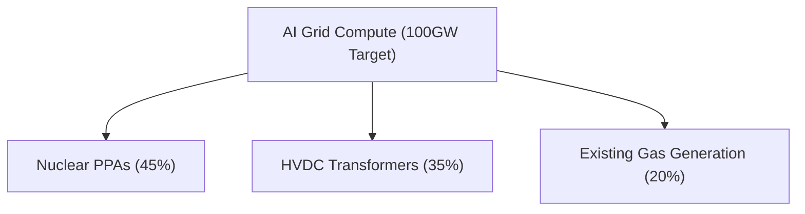

# [CONFIDENTIAL] Sovereign Wealth & Strategic Infrastructure Positioning

**Status:** Highly Classified · For Internal Distribution Only

## Executive Thesis

Under a paradigm shift where Kevin Warsh guides the Fed toward anti-guidance data dependency, and Brent stays above $110/bbl, global asset allocation models require a fundamental re-weighting of direct compute assets toward the physical bottlenecks.

## Quantitative Infrastructure Targets

## Key Strategic Plays

1. **CEG (Constellation Energy):** Contracted behind-the-meter PPAs with key hyperscalers. High cash flow certainty under high-rate regimes.
2. **GEV (GE Vernova):** Monopolistic position in grid turbines and transformer engineering. Severe backlog extends to 2029.

---
*Generated by the AI Institute Strategy Committee.*
