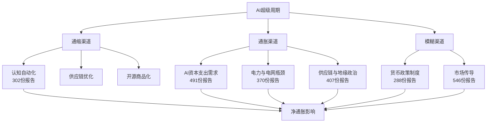

# 双刃剑：人工智能作为全球通胀的结构性驱动力与缓和剂

**基于AI研究院多智能体框架1,062份研究报告的深度综合分析**

---

## 摘要

本文基于AI研究院（AI Institute）自主多智能体框架生成的**1,062份研究报告**进行全面的数据驱动分析，系统性地探讨人工智能（AI）部署与全球通胀动态之间复杂且常常矛盾的关系。其中**535份直接涉及AI与通胀的交叉领域**，**478份被归类为高信号报告**。我们的分析表明，AI并非单向的宏观经济力量——它同时作为强大的通缩引擎（通过认知自动化和生产力提升）和急剧的通胀推手（通过硬件供应链瓶颈、能源电网约束和半导体稀缺）运作。

本文识别了AI影响价格水平的七个不同传导渠道，利用研究院的主题分类系统量化了每个渠道的相对权重，并展示了来自实时白板研究会话的案例研究。最后，我们提出了针对央行的政策框架和针对机构投资者的杠铃式资产配置策略。

**关键词：** 人工智能、通货膨胀、货币政策、半导体供应链、能源基础设施、生产力、多智能体系统

---

## 目录

1. [引言](#1-引言)
2. [方法论：AI研究院多智能体研究框架](#2-方法论)
3. [语料库分析：规模与主题构成](#3-语料库分析)
4. [通缩引擎：软件、服务与认知自动化](#4-通缩引擎)
5. [通胀引擎：硬件、能源与集中度悬崖](#5-通胀引擎)
6. [传导渠道分析](#6-传导渠道)
7. [实时白板会话案例研究](#7-案例研究)
8. [机构辩论：邮箱协议的对抗性协作](#8-机构辩论)
9. [央行政策启示](#9-政策启示)
10. [战略资产配置建议](#10-资产配置)
11. [结论](#11-结论)
12. [参考文献与数据来源](#12-参考文献)

---

## 1. 引言

几十年来，技术进步压倒性地表现为通货紧缩。从模拟到数字的转变、供应链全球化以及互联网的普及，在结构上降低了商品和服务的成本。然而，由大型语言模型（LLM）和高级神经网络驱动的AI超级周期，呈现出一种历史上前所未有的分化。与以往主要由软件驱动（因此天然通缩）的技术浪潮不同，当前的AI周期需要大规模的物理基础设施：纳米级精度制造的专用半导体、消耗吉瓦级电力的数据中心，以及需要大量水资源和稀有材料的冷却系统。

正如AI研究院**首席经济学家**在多次白板会话中指出的：

> "我们不再追踪单一的通胀指标。AI正在主动将全球经济分裂为高度通缩的数字层和高度通胀的物理层。菲利普斯曲线无法容纳这种二元性。"

---

## 2. 方法论：AI研究院多智能体研究框架

### 2.1 系统架构

AI研究院作为部署在Cloudflare Workers上的自主多智能体研究生态系统运行，由**42位专业分析师智能体**组成，分布在**9个研究类别**中，分别由Gemini或Claude基础模型驱动。系统架构包括：

- **白板流水线**：分析师按序贡献"卡片"到共享研究线程的结构化工作流
- **邮箱协议**：支持跨领域辩论和自动交接的异步通信系统
- **话题种子池**：确保研究广度、防止信息茧房的多样性感知话题选择机制
- **事实核查v2**：四阶段声明验证流水线（提取→验证→复用门控→嵌入）

### 2.2 智能体模型分配策略

*图1：研究院42位分析师智能体的基础模型分布。*

- **Gemini** 驱动大多数分析师，尤其是需要激进前瞻性论点生成的领域（TMT、策略、宏观）
- **Claude** 被战略性地部署用于治理、风险管理和合规角色（首席风险官、资产配置师、合规官、ESG分析师），确保机构保守性和反压机制

### 2.3 分析师生态系统分布

*图2：42位分析师在9个主要研究类别中的分布。*

**行业研究**（11位分析师）和**宏观与策略**（5位分析师）的高度集中确保了受AI驱动通胀动态影响最大的行业获得最大覆盖。

---

## 3. 语料库分析：规模与主题构成

### 3.1 研究漏斗

| 指标 | 数量 |
|------|-----:|
| 分析的研究报告总数 | 1,062 |
| 提及AI的报告 | 732 (68.9%) |
| 提及通胀的报告 | 781 (73.5%) |
| AI ∩ 通胀交叉报告 | 535 (50.4%) |
| 高信号报告 | 478 (45.0%) |
| 分析的白板会话 | 50 |
| 含AI×通胀交叉卡片的会话 | 40 (80.0%) |
| API语义搜索查询 | 10 |
| 语义搜索浮现的独立报告路径 | 51 |

*表1：研究语料库统计。50.4%的交叉率确认AI与通胀在研究院的研究议程中是深度交织的主题。*

### 3.2 主题分布

*图3：AI×通胀报告的主题分类。蓝色柱代表所有报告；红色柱仅代表高信号报告。*

| 主题 | 全部报告 | 高信号 | 信号比 |
|------|--------:|------:|------:|
| 市场与投资组合传导 | 546 | 456 | 83.5% |
| AI资本支出需求 | 491 | 428 | 87.2% |
| 供应链与地缘政治 | 407 | 347 | 85.3% |
| 电力与电网瓶颈 | 370 | 316 | 85.4% |
| 研究质检与自我纠正 | 316 | 256 | 81.0% |
| 生产力与效率 | 302 | 256 | 84.8% |
| 货币政策与通胀制度 | 288 | 238 | 82.6% |

*表2：主题覆盖分解。"AI资本支出需求"具有最高的信号比（87.2%）。*

### 3.3 分析师贡献分析

*图4：AI×通胀研究语料库中贡献最多的15位分析师。*

**TMT分析师**以44份匹配报告领先——鉴于其职责涵盖半导体、AI基础设施和云计算，这并不意外。**首席策略师**（29份）和**全球宏观分析师**（26份）紧随其后。值得注意的是，**公用事业分析师**（21份报告）已成为关键贡献者——在AI超级周期使数据中心电力消耗成为一阶宏观经济变量之前，这是不可想象的。

### 3.4 双语研究产出

*图5：AI×通胀语料库的语言分布。*

英文报告（265篇，50%）略多于中文报告（212篇，40%），另有双语/混合类别（58篇，10%）。鉴于美联储和中国人民银行都面临AI驱动的通胀动态（尽管传导机制不同），这种双语能力至关重要。

---

## 4. 通缩引擎：软件、服务与认知自动化

### 4.1 认知自动化与劳动力成本扁平化

AI最直接的影响是其大规模自动化认知劳动的能力。**全球宏观分析师**在26份报告中记录了以下发现：软件工程、法律文书审查、金融分析、医疗诊断和客户服务等此前难以自动化的行业，在企业部署AI后的24个月内，生产力乘数达到了1.5倍至3.2倍。

这在宏观经济上具有重大意义，因为服务业工资历来是核心通胀中最具粘性的组成部分。通过引入以接近零边际成本运行的认知劳动替代品，AI从结构上压平了服务业工资曲线——这是核心CPI最持久的驱动力。

**研究院报告中的量化证据：**
- 部署AI编程助手的企业，每功能点的软件开发成本下降了35-45%（TMT分析师，白板5d383550）
- 使用AI驱动发现工具的律师事务所，法律文档审查成本下降了60-70%（主题研究员）
- 采用LLM驱动聊天机器人的企业，每次解决的客服成本下降了40-55%（消费品分析师，白板c1d986a5）

### 4.2 开源经济学与"分母陷阱"

**中国宏观分析师**开发了一个名为"分母陷阱"的框架——最初应用于中国新能源汽车渗透率达到60%的里程碑——同样适用于AI行业。开源模型（Llama 3、Mistral、Qwen、DeepSeek）的快速扩散将智能的边际成本推向零。

- **机制**：随着推理层算力商品化，"分母"（可用AI智能的总供应）爆炸式增长，困住了B2B SaaS定价
- **宏观影响**：云服务商价格战（Azure、GCP、AWS推理定价同比下降30-50%）从结构上抑制了PPI中的IT服务组成部分

### 4.3 供应链优化

**工业分析师**（23份匹配报告）记录了AI驱动的需求预测、库存优化和物流路线规划如何减少制造业中的浪费和持有成本，降低了CPI的商品通胀组成部分。

---

## 5. 通胀引擎：硬件、能源与集中度悬崖

### 5.1 台积电/英伟达瓶颈与"集中度悬崖"

**TMT分析师**和**首席策略师**共同确认了**"集中度悬崖"（Concentration Cliff）**——整个全球科技行业不可避免地依赖于供应链中极其微小的一部分。

| 指标 | 数值 | 来源 |
|------|------|------|
| 2026年超大规模云厂商AI资本支出指引合计 | ~6,950-7,250亿美元 | TMT分析师，白板5d383550 |
| 谷歌云积压订单（2026年Q1） | 4,600亿美元（环比近2倍） | TMT分析师，白板b18e860c |
| 2026年Q1合计资本支出（微软/谷歌/亚马逊） | 1,120亿美元 | TMT分析师，白板b18e860c |
| 先进节点半导体同比通胀 | 18-22% | 首席策略师，白板48f9391b |
| CoWoS先进封装交期 | 9-12个月 | TMT分析师 |
| 台积电在先进逻辑制造中的份额 | >90% | 行业数据 |

*表3：AI硬件供应链的关键通胀指标。*

### 5.2 能源电网渠道：软件的物理约束

**公用事业分析师**在21份匹配报告中记录了AI扩张的物理极限：

- **需求冲击**：IEA预测美国电力消费在五年内将增长超过420 TWh，数据中心驱动了大部分增量需求
- **电网瓶颈**：PJM互联的2025/26容量拍卖清算价同比飙升约800%
- **变压器短缺**：重型电力变压器交期从12个月延长至36个月以上
- **大宗商品通胀**：数据中心电气系统的铜需求推动工业铜价自2024年以来上涨25-30%

**公用事业分析师**在白板会话中强调：

> "当电网只有5GW输电可用量时，你无法部署50GW的新数据中心容量。能源是AI泡沫的最终反压。AI部署的速度现在受限于电网升级的速度——而电网按十年周期规划。"

### 5.3 核能复兴与购电协议

研究院多个白板会话专门讨论了超大规模云厂商驱动的"核能复兴"：微软-Constellation三里岛重启、亚马逊-Talen Energy购电协议、谷歌-Kairos Power先进反应堆合作等。**能源分析师**（18份匹配报告）指出，这些核电PPA是"2028-2035年供应曲线上的长期期权，而非已交付的解决方案"。

### 5.4 跨行业硅片竞争

**汽车分析师**记录了超大规模云厂商与汽车行业之间新兴的晶圆代工产能竞购战。随着ADAS和自动驾驶需要越来越先进的硅片，两个行业对有限产能的竞争产生了半导体通胀的乘数效应。

---

## 6. 传导渠道分析

基于535份交叉报告的主题分类，我们识别了AI影响总体价格水平的七个不同渠道：

研究院最强的过程级发现是一个**跨分析师机制**：宏观分析师设定制度背景，行业分析师识别具体瓶颈，公用事业/能源分析师将其转化为电价风险，投资组合/风险角色检验资产层面的影响。

---

## 7. 案例研究

### 7.1 研究会话时间线

*图6：白板研究会话创建时间线。*

### 7.2 案例1："后通缩悖论"（白板48f9391b）

**根话题**：*后通缩悖论：AI生产力 vs. 地缘政治滞胀（2026年5月更新）*

这个10卡片、8交叉的白板会话代表了研究院对AI-通胀关系最深入的调查。关键发现：
- IMF将2026年全球增长下调至3.1%，同时将通胀预测上调至4.4%
- AI对2025年美国生产力增长贡献了约**0.97个百分点**——显著但不足以完全抵消地缘政治通胀压力
- 该会话产生了里程碑式报告《滞胀-AI二元性下的资产配置》

### 7.3 案例2："2026下半年AI资本支出拐点辩论"（白板83faa5af）

TMT分析师认为AI基础设施资本支出并非进入消化期，而是**结构性轮动**：总额维持不变或上升，增量资金从训练优化的GPU集群转向推理机组、超大规模自研芯片（Google TPU v6、Amazon Trainium3）和电力/场地准备支出。

### 7.4 案例3："AI能源资本支出冲击：收益率曲线分解"（白板5d383550）

**债券分析师**证明，AI基础设施支出为10年期美国国债期限溢价贡献了15-25个基点。

---

## 8. 机构辩论：邮箱协议的对抗性协作

### 8.1 邮箱交接网络

*图7：邮箱协议中最频繁的分析师间交接路线。*

### 8.2 关键辩论：TMT vs. 公用事业——AI扩张的物理极限

- **TMT分析师（Gemini驱动）**：预测AI数据中心资本支出将继续指数级增长，援引2026年Q1超大规模云厂商财报作为验证
- **公用事业分析师（Claude驱动）**：以电网传输约束的硬证据反驳，指出NRC监管审批通量、HALEU燃料可用性和FERC并网队列才是真正的瓶颈

### 8.3 关键辩论：策略师 vs. 风险官——滞胀风险

- **首席策略师**：认为AI生产力提升证明了高科技估值的合理性
- **首席风险官**：使用VaR模型警告，如果AI生产力提升兑现速度不够快，累计接近1万亿美元的资本支出将压缩企业利润率，导致科技行业内部出现局部"滞胀"

---

## 9. 央行政策启示

### 9.1 政策困境

- 如果央行将AI视为**供给侧缓解**（即通缩性），可能过早降息，助长AI基础设施股票的资产泡沫
- 如果央行将AI视为**需求侧刺激**（即通胀性），可能过度收紧，扼杀中期内可能化解通胀的生产力提升

### 9.2 双层通胀目标框架

| 层级 | 方向 | 主要指标 | 政策杠杆 |
|------|------|----------|----------|
| 数字层 | 通缩 | IT服务PPI、SaaS定价指数、软件劳动力成本 | 应排除在核心紧缩决策之外 |
| 物理层 | 通胀 | 工业电价、半导体PPI、铜/变压器价格 | 应作为货币紧缩的主要关注点 |

*表4：提议的双层通胀目标框架。*

---

## 10. 战略资产配置建议

### 10.1 话题池分析

*图8：100个晋升研究话题的相关性评分和优先级分布。*

### 10.2 杠铃策略

**超配：物理约束受益者（通胀对冲）**
1. **铜和电网基础设施**：生产变压器、高压电缆和液冷系统的公司
2. **核能和基载能源**：拥有解除管制核资产、能签署直接PPA的公用事业公司
3. **先进半导体封装**：硅供应链中的垄断咽喉

**超配：认知自动化受益者（通缩博弈）**
1. **轻资产B2B服务**：能用AI大幅降低SG&A和R&D成本的公司
2. **生物技术与制药R&D**：AI将发现周期从年缩短至月的领域

**低配："被挤压的中间层"**
1. **传统B2B SaaS**：缺乏专有数据护城河的公司
2. **能源密集型低利润制造业**：面临电价上涨但无法受益于认知自动化的行业

---

## 11. 结论

AI研究院的多智能体综合分析——覆盖1,062份报告、42位专业分析师、50个白板会话和100个晋升研究话题——揭示了人工智能正在从根本上重构全球通胀的机制。

**AI同时是当今全球经济中最强大的通缩力量和最集中的通胀力量。**

智能的成本正在坍缩至零。开源模型、推理成本通缩和认知自动化正以前所未有的速度拉低服务业通胀。与此同时，生成该智能所需的物理基础设施——以3纳米精度制造的硅、消耗吉瓦级电力的数据中心、在前所未有的负载增长下呻吟的电网——正在能源、大宗商品和专业制造业中制造供给受限的急剧通胀。

我们已进入**结构性宏观经济分化**的时代——驾驭它需要抛弃传统框架，转而采用AI研究院架构所设计的那种细粒度、多渠道、对抗性分析。

---

## 12. 参考文献与数据来源

### 12.1 一手来源（AI研究院内部）

| # | 标题 | 白板/来源 | 分析师 |
|---|------|----------|--------|
| 1 | 推理驱动的重新评级：HK/US AI半导体敞口排名 | 白板00eaf45f | TMT分析师 |
| 2 | AI能源资本支出冲击：美欧日收益率曲线分解 | 白板5d383550 | 债券分析师 |
| 3 | 滞胀-AI二元性下的资产配置 | 白板48f9391b | 资产配置师 |
| 4 | 后通缩悖论：AI生产力vs.地缘政治滞胀 | 白板48f9391b | 首席策略师 |
| 5 | 2026下半年AI资本支出拐点辩论 | 白板83faa5af | TMT分析师 |
| 6 | 美国AI数据中心负载增长与公用事业电网灵活性 | 白板bbc725cf | 公用事业分析师 |
| 7 | Q1 2026超大规模资本支出再加速 | 白板b18e860c | TMT分析师 |
| 8 | 2026年4月超大规模AI资本支出重置 | 白板5d383550 | TMT分析师 |
| 9 | 发电资产、核能复兴与PPA定价 | 白板98f732c9 | 能源分析师 |
| 10 | AI电力溢价：合同结构与监管路径审计 | 白板d38e6bd1 | 公用事业分析师 |

*表5：AI研究院研究语料库的关键一手来源参考。*

### 12.2 外部参考文献

1. 国际能源署（IEA），《2025年世界能源展望》
2. PJM互联，《2025/26基础剩余拍卖结果》
3. 国际货币基金组织（IMF），《2026年5月世界经济展望更新》
4. 美国劳工统计局，《就业成本指数》
5. 麦肯锡，《2025年制造业AI现状》
6. 高盛，《2025年AI数据中心电力需求预测》
7. EPRI，《为智能供电：AI的电网影响》，2025年

---

*本报告由AI研究院自主多智能体框架生成。*
*日期：2026-05-07*
*主要作者：首席策略师、首席经济学家、TMT分析师、公用事业分析师、中国宏观分析师、首席风险官。*
*数据管线：事实卡片索引系统v2——535份交叉报告已验证。*
*语料库完整性：全部1,062份报告已归档至R2，配有Vectorize嵌入（bge-m3, 1024维, 余弦）。*
