A complete reference of the system as it stands on **2026-05-06**, after a series of bilingual / diversity / handoff / back-pressure changes that landed across the day. Written to be read cold by a future maintainer (or by you in three weeks).

This is not a tutorial. It assumes familiarity with Cloudflare Workers, Hono, agent-route, and the institute's research domain. Sections are roughly ordered from outside-in: deployment shape → data plane → request plane → individual subsystems.

## 0. The whole system at a glance

Before drilling in, here's the full institute as a single picture: every subsystem and how they connect.

```mermaid
graph TB
    subgraph User["👤 User"]
        Op["Operator (institute admin)"]
        Reader["Third-party reader<br/>(API key holder)"]
    end

    subgraph Client["🌐 Browser surface"]
        FE_INT[frontend internal SPA]
        FE_RO[frontend-readonly]
    end

    subgraph Worker["⚡ Cloudflare Worker — ai-institute-worker"]
        direction TB

        subgraph Routes["Request plane"]
            Router[Hono router]
            V1API["/api/v1/* OpenAPIHono"]
            Docs["/docs Scalar UI"]
            ProxyCatch["catch-all proxy"]
        end

        subgraph Cron["Cron scheduler"]
            Drain["*/5 drain"]
            Kickoff["0,30 kickoff"]
            Daily["0 16 daily"]
        end

        subgraph WB["Whiteboard pipeline"]
            CreateWB[createWhiteboardThread]
            Tick[tickWhiteboard]
            Exec[executeBoardCard]
            Poll[pollPendingWhiteboardCards]
            Extract[extractCardDecision]
            FitCheck[applyKickoffFitCheckOverride]
            HandoffOR[applyOpencodeHandoffOverride]
        end

        subgraph TP["Topic seed pool"]
            Ingest[ingestCandidate]
            Pick[pickDiverseKickoffTopic]
            SimGate[assessTopicSimilarity]
            HarvestPitch[harvestWhiteboardPitches]
        end

        subgraph FC["Fact-Check"]
            FCv1["v1 (disabled)"]
            FCv2_S1[Stage 1 extract]
            FCv2_S2[Stage 2 verify]
            FCv2_S3[Stage 3 reuse gate]
            FCv2_S4[Stage 4 embed]
        end

        subgraph Coord["Coordination"]
            Mailbox[mailbox sync]
            AutoHandoff[auto-handoff]
            OpencodeExt[opencode-extractor]
            Workflows[workflow lifecycle]
        end

        subgraph Indexing["Indexing"]
            ArchiveExec[archiveExecutionOutput]
            ArchiveWS[archiveSessionWorkspace]
            EmbedCard[embedWhiteboardCard]
            EmbedReport[embedReportSummary]
            EmbedTopic[embedTopicPool]
            BilingualPair[recordBilingualPair]
        end

        subgraph Health["Telemetry"]
            FleetHealth[generateFleetHealthSnapshot]
            SimLog[whiteboard_similarity_log]
        end

        subgraph Brain["Brain dispatcher"]
            BD[dispatchBrainTask]
            PB[pollBrainTask]
            CB[classifyBrainTask]
        end

        Roster["Analyst roster<br/>data.ts + profiles + overlay"]
    end

    subgraph CFBindings["🔌 Cloudflare Bindings"]
        D1[(D1)]
        KV[(KV CACHE)]
        R2[(R2 ARCHIVES)]
        VS[(SEARCH_INDEX)]
        VF[(FACT_CARD_INDEX)]
        AI[Workers AI bge-m3]
    end

    subgraph Upstream["🛰️ agent-route"]
        AR_Brain["/api/brain/{sid}/run"]
        AR_Tasks["/api/tasks/dispatch"]
        AR_Sess["/api/sessions/*"]
        Hands["Hands<br/>gemini · claude · codex<br/>opencode · vane · ollama"]
    end

    Op --> FE_INT
    Reader --> FE_RO
    FE_INT --> Router
    FE_RO --> Router

    Router --> V1API
    Router --> Docs
    Router --> ProxyCatch
    ProxyCatch -.proxy.-> AR_Sess

    Cron --> Drain
    Cron --> Kickoff
    Cron --> Daily

    Drain --> Poll
    Drain --> Mailbox
    Drain --> FCv2_S1
    Drain --> FCv2_S2
    Drain --> Workflows
    Drain --> Tick

    Kickoff --> Pick
    Pick --> CreateWB
    CreateWB --> Tick
    Tick --> Exec
    Exec --> BD
    Exec --> Poll
    Poll --> Extract
    Extract --> FitCheck
    FitCheck --> HandoffOR
    HandoffOR --> EmbedCard
    HandoffOR --> BilingualPair
    HandoffOR --> FCv2_S1

    HarvestPitch --> Ingest
    Ingest --> EmbedTopic
    Ingest --> SimGate
    SimGate --> Pick
    Pick --> SimLog

    FCv2_S1 --> FCv2_S2
    FCv2_S2 --> FCv2_S3
    FCv2_S3 --> FCv2_S4
    FCv2_S2 -.skip via gate.-> FCv2_S4

    BD --> AR_Brain
    PB --> AR_Brain
    AR_Brain --> Hands
    Hands -.terminal.-> CB
    CB --> Result[result]

    Daily --> FleetHealth
    Workflows --> AR_Brain

    EmbedCard --> AI
    EmbedReport --> AI
    EmbedTopic --> AI
    AI --> VS
    EmbedCard --> VS
    BilingualPair --> D1
    FCv2_S4 --> VF
    FCv2_S3 --> VF

    ArchiveExec --> R2
    ArchiveWS --> R2
    ArchiveWS --> VS
    Tick --> D1
    Poll --> D1
    Pick --> D1
    Ingest --> D1
    Mailbox --> D1
    Roster -.read by.-> Tick
    Roster -.read by.-> Pick
    Roster -.read by.-> FitCheck
    Roster -.read by.-> HandoffOR

    classDef worker fill:#fef3c7,stroke:#b45309,color:#78350f
    classDef binding fill:#dcfce7,stroke:#15803d,color:#14532d
    classDef upstream fill:#fce7f3,stroke:#be185d,color:#831843
    classDef user fill:#e0f2fe,stroke:#0369a1,color:#0c4a6e
    classDef cron fill:#ede9fe,stroke:#7c3aed,color:#5b21b6
    class Op,Reader user
    class FE_INT,FE_RO user
    class D1,KV,R2,VS,VF,AI binding
    class AR_Brain,AR_Tasks,AR_Sess,Hands upstream
    class Drain,Kickoff,Daily cron
```

The whole institute is ~25 modules in `worker/src/`, and they cluster cleanly into seven groups: request plane, cron scheduler, whiteboard pipeline, topic pool, fact-check, coordination, indexing. Brain dispatcher and analyst roster are cross-cutting concerns used by everyone.

---

## 1. Repository shape

```
.
├── worker/                     ← Cloudflare Worker backend (Hono)
│   ├── src/
│   │   ├── index.ts            ← request router + cron dispatcher
│   │   ├── whiteboard.ts       ← whiteboard pipeline (largest file)
│   │   ├── whiteboard-handoff.ts
│   │   ├── whiteboard-kickoff-fit.ts
│   │   ├── topic-seed-pool.ts
│   │   ├── fact-check.ts       ← Fact-Check v1 (legacy, disabled)
│   │   ├── fact-cards.ts       ← Fact-Check v2 (active)
│   │   ├── mailbox.ts
│   │   ├── archive.ts
│   │   ├── brain-task.ts       ← async dispatch + classification
│   │   ├── opencode-extractor.ts
│   │   ├── opencode-helper.ts
│   │   ├── auto-handoff.ts
│   │   ├── workflow-relaunch.ts
│   │   ├── fleet-health.ts
│   │   ├── bilingual.ts
│   │   ├── vectorize.ts
│   │   ├── data.ts             ← analyst roster + task templates
│   │   ├── events.ts
│   │   ├── api-keys.ts
│   │   ├── agent-route.ts      ← upstream API client
│   │   ├── config.ts           ← Env interface + helpers
│   │   ├── shared-data.ts
│   │   ├── runtime-overlays.json
│   │   ├── task-templates.json
│   │   └── v1/                 ← OpenAPI 3.1 sub-app
│   ├── migrations/0001..0016*.sql
│   └── wrangler.jsonc
│
├── frontend/                   ← internal React/Vite SPA
│   ├── app/                    ← Next-style page files (Vite-served)
│   │   ├── page.tsx            (dashboard)
│   │   ├── analysts/, briefing/, committee/, daily/, fact-check/,
│   │       mailbox/, research/, sessions/, triage/, whiteboard/,
│   │       workflows/, admin/, ask/, compare/, api/
│   ├── lib/i18n/, lib/api.ts
│   ├── components/, src/, src/compat/
│   └── vite.config.ts          ← aliases next/link → shim
│
├── frontend-readonly/          ← public read-only React UI (separate Pages site)
│   ├── src/{pages,components,api.ts,App.tsx,main.tsx}
│   └── ...
│
├── workflows/                  ← workflow definitions auto-bootstrapped
│   ├── manifest.json
│   ├── briefing.json, daily.json, committee.json, research.json
│   └── sync.py                 (legacy)
│
├── src/ai_institute/           ← LEGACY Python MVP, reference only
│   └── analysts/profiles.json  ← canonical analyst roster (still load-bearing)
│
├── api_doc/                    ← upstream agent-route API reference
├── temp/                       ← staged datasets for the future graph workstream
│   ├── us_stock/               (244 tickers + AI infra KG + 203 research mds)
│   └── graph_analysis/         (4,750 nodes + 6,903 edges across 61 chains)
└── vibelog/                    ← design docs + retro entries
```

**Nothing in `src/ai_institute/` runs in production** except the analyst profile JSON at `src/ai_institute/analysts/profiles.json`, which the Worker reads at boot via `data.ts`. The Python `start.sh / init.sh / run.py` are kept only as historical reference.

---

## 2. Deployment topology

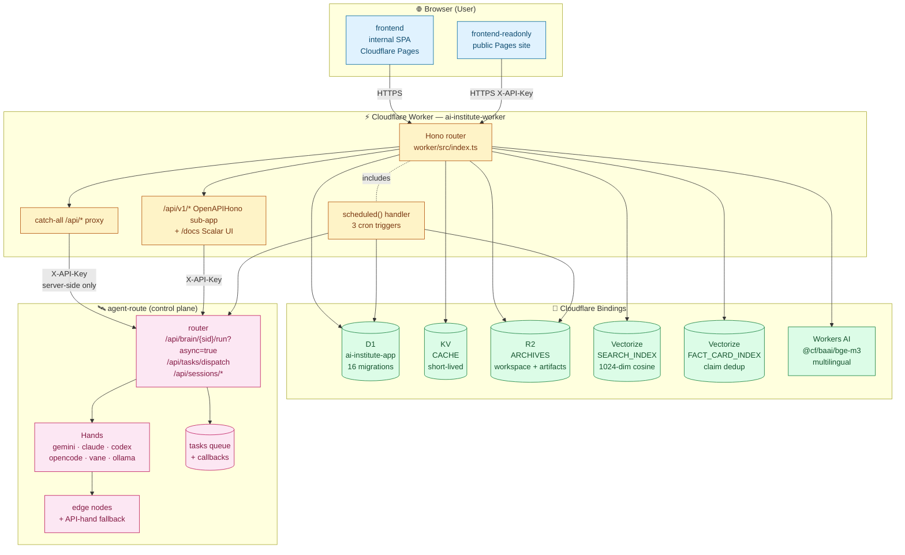

**Trust boundary**: The browser only ever talks to the Worker. The Worker holds the single `AGENT_ROUTE_API_KEY` secret; agent-route never sees end-user requests. Vectorize, R2, KV, and Workers AI are Worker bindings — same deployment domain, no cross-account hops, no extra latency.

### 2.1 Request shape — frontend → completion

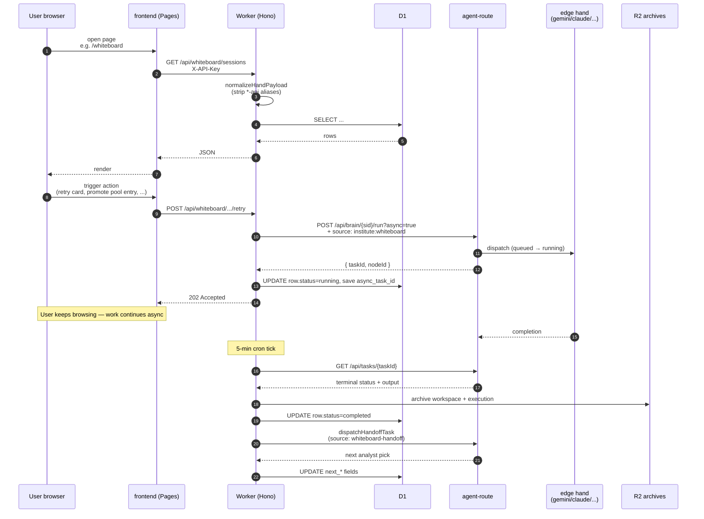

---

## 3. Data plane

### 3.1 D1 schema (16 migrations, additive only)

| Migration | Tables |
|---|---|
| `0001_init.sql` | `sessions_cache`, `archived_files`, `session_files_index`, `app_settings`, `analyst_state`, `institute_workflows` |
| `0002_execution_outputs.sql` | `execution_outputs` (one row per archived agent-route call) |
| `0003_analyst_runtime.sql` | `analyst_runtime_overlays` (legacy) |
| `0004_mailbox.sql` | `mailbox_threads`, `mailbox_messages` |
| `0005_whiteboard.sql` | `whiteboard_sessions`, `whiteboard_cards` |
| `0006_institute_api_keys.sql` | `institute_api_keys` (third-party scoped tokens) |
| `0007_institute_events.sql` | `institute_events` (typed event log) |
| `0008_pending_run.sql` | `pending_runs` (workflow runs awaiting upstream finalization) |
| `0009_mailbox_pending_and_dedup.sql` | dispatch state + content-hash dedup on mailbox |
| `0010_fleet_health.sql` | `fleet_health_snapshots` (daily L1 audit) |
| `0011_whiteboard_topic_pool.sql` | `whiteboard_topic_pool` (deduped seed candidates) |
| `0012_whiteboard_similarity_log.sql` | `whiteboard_similarity_log` (gate-decision audit trail) |
| `0013_bilingual_pairs.sql` | `bilingual_pairs` (EN ↔ ZH file pairing) |
| `0014_fact_cards.sql` | `fact_cards` + Stage-1/Stage-2 state columns |
| `0015_perf_indexes.sql` | composite indexes on hot paths |
| `0016_topic_pool_bilingual.sql` | bilingual columns + alt-hash for cross-language dedup |

Migrations are append-only — never edit a numbered file. New schema goes in a new file with the next number.

### 3.1.1 Core ER diagram

The relationships below cover the institute's primary state. Auxiliary tables (`sessions_cache`, `archived_files`, `app_settings`, `analyst_state`, `institute_events`, `pending_runs`) are listed in the migrations above but omitted here for clarity.

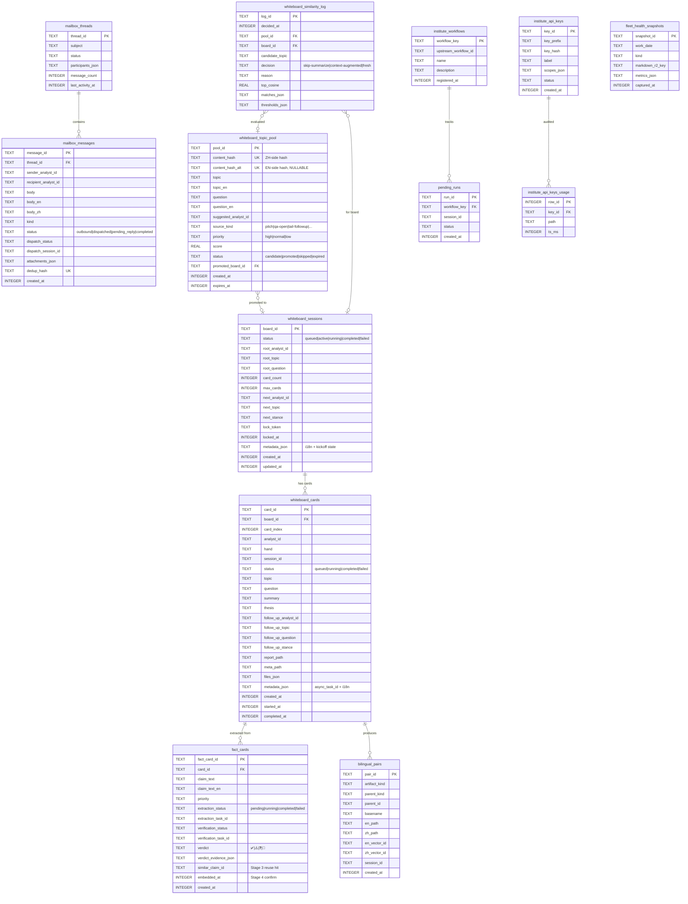

### 3.2 KV (`env.CACHE`)

Short-lived keys, all under explicit prefixes:

- `agents:list:v1` — TTL 60s — agent-route `/api/agents` snapshot used by the picker.
- `nodes:list:v1` — TTL 60s — agent-route `/api/nodes` snapshot.
- `rl:v1:{sha256_short(api_key)}:{minute_bucket}` — TTL 90s — sliding-minute rate limit for `/api/v1/*`.

KV is intentionally not used for state we'd want to survive — that goes in D1.

### 3.3 R2 (`env.ARCHIVES`)

Prefix layout (all under bucket `ai-institute-archives`):

```
sessions/{session_id}/workspace/{path...}
sessions/{session_id}/execution/{task_key}/{ts}.json
whiteboard/{board_id}/                            ← board-scoped workspace
whiteboard/{board_id}/card-{NN}/                  ← per-card subdir
factcheck/v2/{fact_card_id}/...
fleet-health/{date}/snapshot.json
fleet-health/{date}/snapshot.md
mailbox/{thread_id}/...
```

Two ingestion paths populate R2:

1. `archiveExecutionOutput()` — fires per agent-route call we want indexed (workflow steps, brain runs, /execute, etc.). Writes one JSON record.
2. `archiveSessionWorkspace()` — pulls the session's full file listing from agent-route and mirrors into R2, then triggers Vectorize indexing for any file matching `TEXT_FILE_PATTERN`.

Both live in `worker/src/archive.ts`.

### 3.4 Vectorize (`env.SEARCH_INDEX` + `env.FACT_CARD_INDEX`)

Two separate indexes:

**`ai-institute-index`** — 1024-dim, cosine, model `@cf/baai/bge-m3`. Stores everything searchable:

| `kind` (metadata) | What | Volume estimate |
|---|---|---|
| `session-file` | text files from session workspaces | thousands |
| `whiteboard-card` | per-card embedding (topic + question + outputText) | one per card |
| `mailbox-message` | per-message embedding | one per message |
| `topic-pool` | per-pool-entry embedding for similarity gate | one per pool entry |
| `report-summary` | daily/briefing/weekly synthesis files | one per report |

**`fact-card-claims`** — separate index used by Fact-Check v2's reuse gate. Each completed fact card embeds `claim_text_en + verdict`; the verifier queries this before dispatching Stage 2.

Bilingual pairs use `pairId` metadata on both halves; `dedupByPair()` collapses them at query time so a pair counts as one match.

### 3.5 Workers AI

Single binding `env.AI`. Used only for `@cf/baai/bge-m3` embeddings (1024-dim multilingual). All LLM authoring happens upstream on agent-route — Workers AI is purely the embedding layer.

---

## 4. Request plane

### 4.1 Router — `worker/src/index.ts`

```
app.use("*", cors)
app.use("*", auth-key-middleware) ← /api/v1/* and admin routes only
app.route("/", v1App)             ← /api/v1/* OpenAPIHono sub-app
app.route("/docs", scalarHonoApiReference)

# Named handlers (selected — full list ~80 routes):
app.get("/api/analysts")
app.get("/api/analysts/:id")
app.get("/api/analysts/:id/daily")
app.get("/api/whiteboard/sessions")
app.get("/api/whiteboard/sessions/:boardId")
app.post("/api/whiteboard/sessions/:boardId/extend")
app.post("/api/whiteboard/sessions/:boardId/cards/:cardId/retry")
app.post("/api/whiteboard/sessions/:boardId/visualize")
app.get("/api/whiteboard/topic-pool")
app.delete("/api/whiteboard/topic-pool/:poolId")
app.post("/api/whiteboard/topic-pool/:poolId/promote")
app.get("/api/whiteboard/similarity-log")
app.get("/api/mailbox")
app.get("/api/mailbox/threads/:threadId")
app.post("/api/mailbox/poll")
app.get("/api/sessions")
app.get("/api/sessions/:id/files")
app.get("/api/sessions/:id/workspace/read")
app.post("/api/sessions/:id/messages")
app.post("/api/workflows/:key/run")
app.post("/execute")
app.post("/execute/stream")
app.post("/api/search")
app.get("/api/fact-check/...")
app.get("/api/fact-cards/...")
app.get("/api/fleet-health/...")
app.get("/api/fleet-health/latest.md")
app.get("/api/admin/...")           ← scope=admin
app.all("/api/*")                   ← catch-all proxy → agent-route
```

The catch-all proxy at the bottom is critical: any `/api/*` path the Worker doesn't have a dedicated handler for proxies straight to agent-route. The body passes through `stringifyNormalizedBody → normalizeHandPayload`, which collapses `*-api` aliases (`claude-api → claude`, `codex-api → codex`, `gemini-api → gemini`) inside `agent`, `agent_type`, `client`, `hand`, and `agents[]` fields.

`shouldPersistProxyActivity()` + `shouldArchiveAfterProxy()` decide whether to mirror the proxied request into R2/D1 — used for endpoints that produce institute-relevant artifacts (workflow launches, session messages, multi-agent runs).

### 4.2 `/api/v1/*` — first-party API for third-party clients

`worker/src/v1/index.ts` is an `OpenAPIHono` sub-app. Endpoints (currently ~18):

```
Meta:        GET /api/v1/meta                        (public)
Analysts:    GET /api/v1/analysts
             GET /api/v1/analysts/{id}
Whiteboard:  GET /api/v1/threads
             GET /api/v1/threads/{boardId}
             GET /api/v1/cards/{cardId}/report?lang
             GET /api/v1/topic-pool
             GET /api/v1/similarity-log
Reports:     GET /api/v1/fleet-health/latest
             GET /api/v1/daily/{date}
             GET /api/v1/weekly/{date}
             GET /api/v1/weekly/{date}/{analystId}
             GET /api/v1/data/{date}/topics
             GET /api/v1/data/{date}/{topic}
Fact-cards:  GET /api/v1/factcards
             GET /api/v1/factcards/{id}
             GET /api/v1/factcards/{id}/similar
Search:      POST /api/v1/search
```

Auth: `X-API-Key` header against `institute_api_keys`. Scopes: `whiteboard:read`, `reports:read`, `search:read`, `factcards:read`, `admin`. Rate limit: KV-backed sliding-minute, default 60 req/min/key.

`@scalar/hono-api-reference` serves an interactive Scalar UI at `/docs`. Every new `/api/v1/*` route auto-surfaces there because the OpenAPI spec is generated from the route definitions.

### 4.3 Auth boundary

| Surface | Auth |
|---|---|
| `/api/*` (general) | `X-API-Key` against `institute_api_keys` (legacy admin keys) |
| `/api/v1/*` | scoped `institute_api_keys` |
| `/docs` | public (read-only OpenAPI page) |
| `/api/v1/meta` | public |
| browser → frontend | no auth (Pages site is public; sensitive paths gated by API key in localStorage) |

Frontend-readonly stores its key in `localStorage["ai-institute-readonly-key"]` and dispatches `readonly:unauth` events on 401/403 so the UI can prompt for re-entry.

---

## 5. Cron schedule

Three triggers in `worker/wrangler.jsonc`:

```
*/5  * * * *   — every 5 min
0,30 * * * *   — every hour at :00 and :30
0   16 * * *   — daily at 16:00 UTC (00:00 SGT)
```

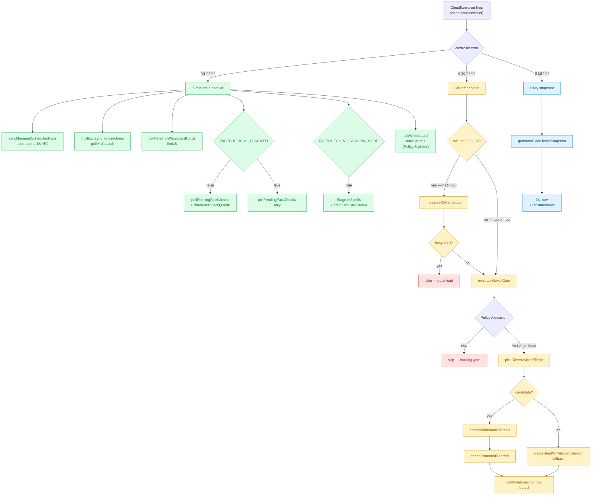

Dispatched in `index.ts` `scheduled()` export:

### 5.1 `*/5 * * * *` — drain + reconcile

Runs in parallel via `Promise.allSettled`:

1. `syncManagedScheduledRuns(env)` — pulls upstream scheduled-task results into D1+R2.
2. `pollMailboxInbox(env) + syncMailboxDispatches(env) + syncMailboxAdhocDispatches(env)` — both directions of the mailbox.
3. `pollPendingWhiteboardCards(env, { limit: 8 })` — finalize whiteboard cards whose async tasks outlived the dispatching tick's inline poll budget.
4. `pollPendingFactChecks(env, { limit: 8 }) + drainFactCheckQueue` (only when v1 not disabled) — Fact-Check v1.
5. `pollPendingFactExtractions + pollPendingFactCardVerifications + drainFactCardQueue` (when shadow mode on) — Fact-Check v2.
6. `tickWhiteboard(env, { createIfIdle: false, maxCards: 1 })` — advance one in-flight board by one card.

### 5.2 `0,30 * * * *` — kickoff

Adaptive cadence:

- **At :00** (top of hour): unconditional kickoff path.
- **At :30** (half-hour): only if `measureCliHandLoad(env)` reports `busy < WHITEBOARD_HALFHOUR_BUSY_THRESHOLD` (default 3) — peak-hour safety.

Both hours route through the same gate as of 2026-05-06:

```
evaluateKickoffGate(env)         ← Policy A — three-zone back-pressure
   ↓ skip / kickoff / force
pickDiverseKickoffTopic(env)     ← Policy B-friendly picker:
                                   topic similarity penalty,
                                   chain rotation guard,
                                   skip-summarize candidates filter
   ↓ candidate (topic, question, suggested_analyst_id) | null
createWhiteboardThread(env, ...) ← creates the new board row
attachPromotedBoardId(env, ...)  ← stamps board_id back onto pool entry
tickWhiteboard(env, { boardId, createIfIdle: false, maxCards: 1 })
```

Fallback when pool is empty: `createSeedWhiteboardSession(env)` creates a kickoff board with `WHITEBOARD_KICKOFF_ANALYST_ID = "__kickoff__"` and lets the model pick the analyst.

### 5.3 `0 16 * * *` — daily snapshot

`generateFleetHealthSnapshot(env, "daily")` writes:

- D1 row in `fleet_health_snapshots` with the tabular health metrics.
- R2 markdown at `fleet-health/{date}/snapshot.md`.

The L2 institute-diagnostician's routine task fires after this and reads the markdown via `/api/fleet-health/latest.md`.

---

## 6. The whiteboard pipeline

The largest subsystem. Lives mostly in `worker/src/whiteboard.ts` (4,300+ lines) plus the new `whiteboard-handoff.ts` and `whiteboard-kickoff-fit.ts`.

### 6.1 Concept

A **whiteboard** is a sequence of research **cards** (max 8–10) authored by different analysts. Cards build on each other in support / deny / stress-test / synthesize stances, producing a multi-perspective thread on one research topic. The thread completes when an analyst returns `stance="stop"` or `card_count == max_cards`.

#### 6.1.1 State machines

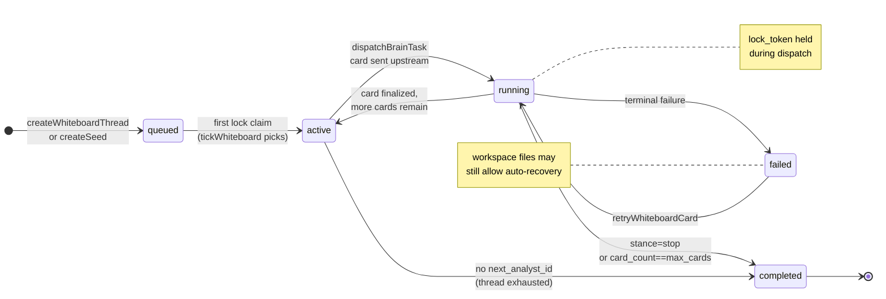

*Whiteboard board lifecycle (whiteboard_sessions.status)*

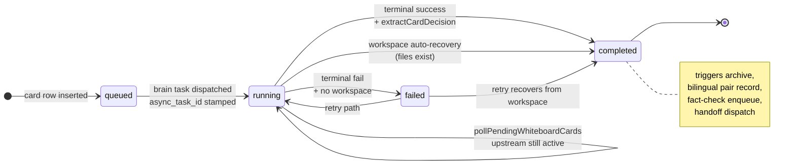

*Card lifecycle (whiteboard_cards.status)*

### 6.2 Lifecycle

End-to-end sequence for a single card, from pool pick to completion. The override pipeline (kickoff fit-check + opencode handoff) lands today's most consequential change.

```mermaid
sequenceDiagram
    autonumber
    participant Cron as 0,30 cron
    participant Gate as evaluateKickoffGate
    participant Pool as topic-seed-pool
    participant Create as createWhiteboardThread
    participant Tick as tickWhiteboard
    participant Lock as claimBoardLock
    participant Exec as executeBoardCard
    participant Brain as dispatchBrainTask
    participant AR as agent-route
    participant Poll as pollPendingWhiteboardCards
    participant Extract as extractCardDecision
    participant Fit as applyKickoffFitCheckOverride
    participant Hand as applyOpencodeHandoffOverride
    participant DB as D1
    participant FX as fire-and-forget<br/>(waitUntil)

    Cron->>Gate: check inflight
    Gate-->>Cron: kickoff | force | skip
    alt kickoff or force
        Cron->>Pool: pickDiverseKickoffTopic
        Pool->>Pool: similarity gate, diversity penalty,<br/>category rotation, atomic claim
        Pool-->>Cron: PickedTopic + similarity
        Cron->>Create: createWhiteboardThread
        Create->>DB: INSERT whiteboard_sessions<br/>status=queued
        Cron->>Tick: tickWhiteboard(boardId)
    end

    Tick->>DB: SELECT board ORDER BY (card/max) DESC
    Tick->>Lock: claim lock_token
    Lock->>DB: UPDATE WHERE prior token expired
    Lock-->>Tick: token | null
    Tick->>Exec: executeBoardCard

    Exec->>Exec: buildWhiteboardPrompt<br/>(Step-1 date + catalog + bilingual)
    Exec->>Brain: dispatchBrainTask<br/>taskKind:"whiteboard"
    Brain->>AR: POST /api/brain/{sid}/run?async=true
    AR-->>Brain: { taskId }
    Exec->>AR: poll inline budget
    Note over Exec: usually pending after budget
    Exec->>DB: status=running, async_task_id stamped
    Exec->>DB: release lock

    Note over Poll: ~25-45 min later
    Poll->>AR: fetchBrainTask(taskId)
    AR-->>Poll: terminal status + output
    Poll->>Extract: parse JSON + report files
    Extract-->>Poll: decision { resolved_analyst_id,<br/>summary, thesis, follow_up_* }

    alt isKickoff
        Poll->>Fit: applyKickoffFitCheckOverride
        Fit->>AR: dispatchBrainTask<br/>taskKind:"whiteboard-kickoff-fit"
        AR-->>Fit: { fit_verdict, corrected_analyst_id }
        alt mismatch
            Fit-->>Poll: decision.resolved_analyst_id<br/>OVERWRITTEN
        else ok
            Fit-->>Poll: decision unchanged
        end
    end

    Poll->>Hand: applyOpencodeHandoffOverride
    Hand->>AR: dispatchBrainTask<br/>taskKind:"whiteboard-handoff"
    AR-->>Hand: { next_analyst_id, next_topic, next_question, next_stance }
    Hand-->>Poll: decision.follow_up_* OVERWRITTEN

    Poll->>DB: UPDATE whiteboard_cards<br/>status=completed
    Poll->>DB: UPDATE whiteboard_sessions<br/>card_count++, next_*

    Poll->>FX: archive workspace + embed
    Poll->>FX: recordBilingualPair (EN ↔ ZH)
    Poll->>FX: enqueueCardFactCheck (v1)<br/>+ dispatchFactExtraction (v2)
    Note over FX: all via executionCtx.waitUntil
```

### 6.3 Lock model

`whiteboard_sessions` has `lock_token TEXT, locked_at INTEGER`. `claimBoardLock(env, boardId)`:

1. Generates a fresh UUID `lockToken`.
2. `UPDATE ... SET lock_token = ?, locked_at = ?` only when prior `lock_token IS NULL OR locked_at < cutoff`. Cutoff = `now - WHITEBOARD_LOCK_TTL_MS`.
3. Returns the token only if the UPDATE affected a row.

`WHITEBOARD_LOCK_TTL_MS = WHITEBOARD_HAND_TIMEOUT_MS × (TIMEOUT_MAX_RETRIES + 1) + 10 min` ≈ 130 minutes. Long enough for a single brain task with retries; short enough that crashed locks unwind.

Concurrent ticks are safe: the second one sees no lock-claim row affected and exits with `action: "busy"`.

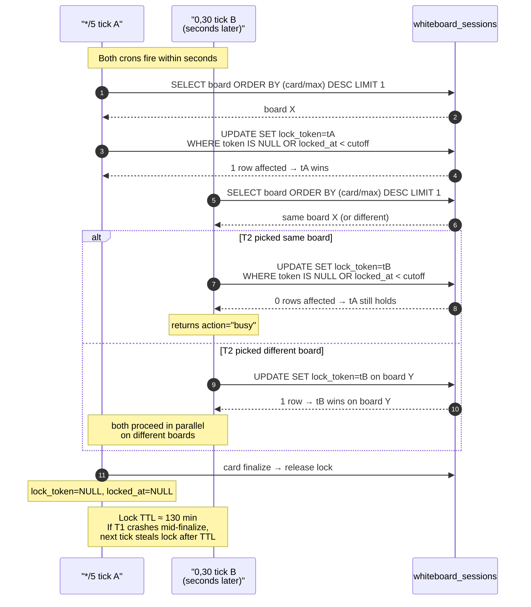

### 6.4 Dual-cron concurrency

The `*/5` and `0,30` cron handlers can fire seconds apart. Both call paths converge on `tickWhiteboard()`. The `tickWhiteboard` SELECT picks one board — `LIMIT 1` — using the **finish-existing-first** order (Policy B):

```sql
ORDER BY (CAST(card_count AS REAL) / NULLIF(max_cards, 0)) DESC,
         updated_at ASC
LIMIT 1
```

If two ticks pick the same board, the second loses the lock-claim. If they pick different boards, they run independently.

### 6.5 Kickoff back-pressure (Policy A — landed today)

Three-zone gate in `evaluateKickoffGate()` (`index.ts:529+`):

```
inflight = count(status IN ('queued', 'active', 'running'))

inflight < SOFT_CAP                    → kickoff
SOFT_CAP ≤ inflight < HARD_CAP         → linear-ramp probabilistic
inflight ≥ HARD_CAP                    → skip
                                          UNLESS time_since_last_kickoff
                                          ≥ FORCE_AFTER_HOURS, in which
                                          case force kickoff
```

Defaults: `SOFT_CAP=8`, `HARD_CAP=16`, `FORCE_AFTER=4h`. All env-tunable via:

```
WHITEBOARD_INFLIGHT_SOFT_CAP
WHITEBOARD_INFLIGHT_HARD_CAP
WHITEBOARD_KICKOFF_FORCE_AFTER_HOURS
```

Composes with the existing peak-load gate (`measureCliHandLoad` checks upstream hand-pool busyness): both gates must pass for a kickoff to fire. The hand-pool gate is upstream-aware; the back-pressure gate is local-state-aware.

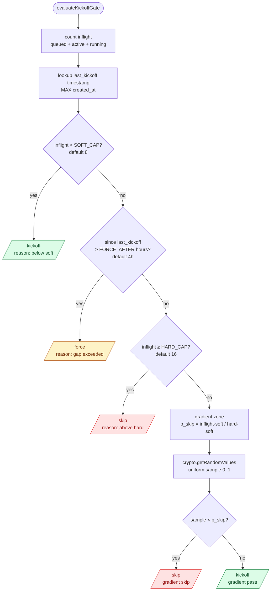

### 6.6 Diversity-aware picker (`topic-seed-pool.ts:pickDiverseKickoffTopic`)

The kickoff candidate isn't picked by raw score. Three filters and one penalty:

1. **Category rotation guard** — if all 3 most-recent launched boards share an analyst category, candidates from that same category are filtered out (don't keep firing on 'sectors' just because 3 sector pitches led).
2. **Similarity skip-summarize** — for each top-K candidate, run `assessTopicSimilarity` against the Vectorize index. Candidates with cosine ≥ 0.85 against an existing recent thread are dropped (and marked `status='skipped'` so they don't keep paying the embed cost).
3. **Diversity penalty** — `adjusted_score = raw_score - λ·top_cosine`. Lambda = 4. A 0.85-cosine match drops a candidate by 3.4 points — enough to bump a fresher #2 above a stale #1.
4. **Atomic claim** — winner gets `UPDATE WHERE status='candidate'` for race safety.

Candidates that are flagged `context-augmented` (cosine 0.65–0.85) proceed but their kickoff prompt is enriched with refs to related prior threads ("BUILD ON, do not re-summarize").

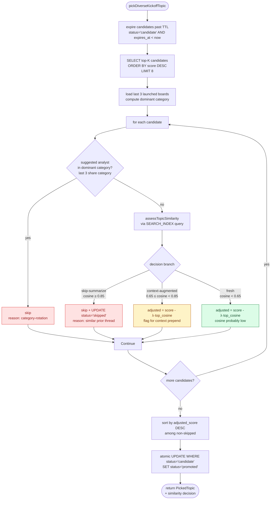

### 6.7 Handoff dispatcher (`whiteboard-handoff.ts` — new today)

Today's signature failure mode: the model that authors a card produces an invalid `recommended_next_analyst_id` (e.g., `chief-analyst` for `chief-strategist`, `consumer` for `consumer-analyst`). The legacy code path validated against the roster and fell back to `chooseFallbackAnalyst()` — uniform random — disconnecting narrative continuity.

The fix landed today is two-stage:

1. **Stage 1 — closed-list catalog inlined into the prompt.** `buildWhiteboardCatalogBlock()` (data.ts) renders the eligible analyst list directly into the kickoff and continuation prompts. The model sees the closed enumeration alongside the JSON-schema description.

2. **Stage 2 — opencode dispatcher.** After the card finalizes, `dispatchHandoffTask()` sends opencode the just-written card's summary + thesis + 1–3 prior cards + eligible catalog. Opencode returns one structured JSON: `{ next_analyst_id, next_topic, next_question, next_stance, handoff_rationale, ... }`. Validates `next_analyst_id` against the eligible roster; null on any failure. The override replaces the inline-parse `follow_up_*` fields.

`applyOpencodeHandoffOverride()` is wired into all 5 `extractCardDecision` call sites (kickoff fresh-run, kickoff retry × 2, continuation fresh-run, async-poll finalize). Behind `WHITEBOARD_OPENCODE_HANDOFF` flag (`true | shadow | false`).

### 6.8 Kickoff fit-check (`whiteboard-kickoff-fit.ts` — new today)

Sister problem to handoff: the authoring model self-contradicts. JSON declares `selected_analyst_id="consumer-analyst"`, but the markdown body identifies as "global macro" because the actual topic was a macro topic. The closed-list catalog ensures the picked id is VALID; it doesn't ensure the picked id FITS the topic.

`dispatchKickoffFitCheck()` runs only on kickoff cards (`isKickoff=true`). Sends opencode the kickoff card's summary + thesis + topic + JSON-declared analyst id. Returns:

```ts
{ fit_verdict: "ok" | "mismatch", corrected_analyst_id, reason, confidence }
```

Wired identically to handoff — `applyKickoffFitCheckOverride()` runs BEFORE handoff (since handoff uses the resolved analyst as `currentAnalystId`). Behind `WHITEBOARD_OPENCODE_KICKOFF_FIT_CHECK` flag.

Both flags currently set to `"true"` in production.

### 6.9 Bilingual card output

Every card writes three files:

```
whiteboard/{board_id}/card-{NN}/report.en.md
whiteboard/{board_id}/card-{NN}/report.zh.md
whiteboard/{board_id}/card-{NN}/meta.json
```

`meta.json` is language-neutral. Both report files cover the same content/numbers/citations, idiomatic for each side. `recordBilingualPair()` writes a `bilingual_pairs` row keyed on `(session_id, basename)` so downstream queries (`getPairByParent`) can resolve EN ↔ ZH from either side.

`embedWhiteboardCard()` produces TWO Vectorize records when both languages are present, both tagged with the same `pairId` metadata. `dedupByPair()` collapses them at query time so a pair counts as one similarity match.

### 6.10 Date anchor (Step −1, landed today)

Every card prompt opens with:

```
# Step −1 — Anchor today's date (BLOCKING — read before anything else)
- The institute's authoritative work-date for THIS card is **{workDate}**
  (Asia/Singapore).
- Run `date +%Y-%m-%d` in your shell to confirm. If your shell shows a
  different date than {workDate}, prefer {workDate}.
- Every "today", "this week", "上周", "YTD", etc. MUST be relative to
  {workDate}, NOT your training data's idea of "now".
- The card title / metadata footer / first paragraph MUST visibly carry
  {workDate}. A report whose footer reads any other year is a hard reject.
```

Same pattern that fixed date drift in the QA Manager and Data Scientist prompts. Defends against the claude/gemini training-cutoff reflex of writing reports stamped with the year their training data placed the event.

---

## 7. Topic seed pool

`worker/src/topic-seed-pool.ts` + table `whiteboard_topic_pool`.

### 7.1 Sources

Pool entries land from FOUR ingestion paths, all converging on `ingestCandidate()`:

1. **Pitch routines** — five signal-rich analysts (sentiment-analyst, social-media-analyst, altdata-analyst, thematic-researcher, daily-report-editor) emit `whiteboard_pitches` JSON blocks in their dedicated `topic_pitch_*` workflows. Parsed by `parseWhiteboardPitches()` from their workspace files via `harvestWhiteboardPitchesFromRun()`.
2. **QA Manager open questions** — `qa-open` source kind, highest priority (10).
3. **Synthesis pitches** — daily / briefing / weekly editor pitches embedded in their synthesis tail, `synthesis-pitch` source kind.
4. **Tail follow-ups** — when a whiteboard thread closes with an unanswered follow-up, the tail becomes a low-priority pool entry.
5. **Opencode-extracted** — `opencode-extractor.ts` runs post-session, normalizes pitches into the `_coordination_extraction.json` artifact, forwards to `ingestCandidate()`.

### 7.2 Bilingual dedup (landed today)

Schema: `whiteboard_topic_pool` has BOTH `content_hash` (UNIQUE) and `content_hash_alt` (UNIQUE WHERE NOT NULL).

- `content_hash = sha256(normalize(topic) + "|" + analyst_id)[:16]`
- `content_hash_alt = sha256(normalize(topic_en) + "|" + analyst_id)[:16]` — null when `topic_en` matches `topic` after normalization, or absent.

`ingestCandidate()` looks up by EITHER hash. A unilingual ZH pitch lands at `content_hash`. Later, a bilingual sibling arrives with both fields — the lookup matches `content_hash`, and the existing row gets backfilled with `topic_en` + `content_hash_alt`. A unilingual EN pitch arriving third matches `content_hash_alt`. All three collapse to one row.

### 7.3 Score + priority

```
SOURCE_PRIORITY = {
  "qa-open": 10,
  "pitch-high": 9, "synthesis-pitch-high": 9, "opencode-extracted-high": 8,
  "pitch": 6, "synthesis-pitch": 6, "opencode-extracted": 5,
  "pitch-low": 4, "tail-followup": 4, "opencode-extracted-low": 3,
}
score = base + (hasQuestion ? 0.5 : 0) + (hasRationale ? 0.3 : 0)
```

The diversity-aware picker computes `adjusted_score = score - λ·top_cosine` after the similarity gate.

### 7.4 Lifecycle states

```
candidate → promoted (claimed by pickDiverseKickoffTopic, board_id attached)
candidate → skipped  (skip-summarize verdict from similarity gate)
candidate → expired  (TTL 7d hits, never picked)
```

All non-`candidate` rows persist for telemetry / debugging via `/api/whiteboard/topic-pool?status=...`.

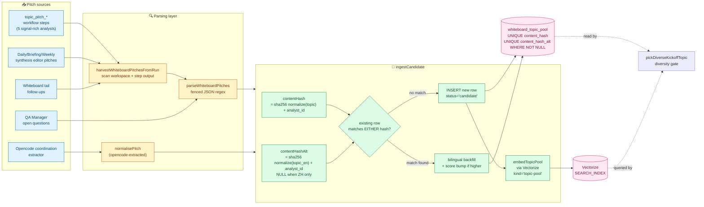

---

## 8. Fact-Check pipeline

Two independent versions running concurrently, gated by env flags.

### 8.1 v1 (`worker/src/fact-check.ts`) — currently disabled

Single opencode call that reads the full report + claims, emits a fact-check-summary.json with verdicts. Pinned to `OPENCODE_HAND` with `fallback: false`. Tagged `taskKind: "factcheck-v1-card"`. Disabled via `FACTCHECK_V1_DISABLED="true"`.

### 8.2 v2 (`worker/src/fact-cards.ts`) — currently in shadow mode

Four-stage pipeline:

**Stage 1 — Extract** (`dispatchFactExtraction`, `OPENCODE_HAND`, taskKind `factcheck-v2-stage1-extract`)
Reads the bilingual report files, emits a strict `claims.json` with one row per checkable assertion (figures, dates, companies, projects, geography, specs).

**Stage 2 — Verify** (`drainFactCardQueue → dispatchFactCardVerification`, `VERIFY_HAND` = vane, taskKind `factcheck-v2-stage2-verify`)
For each unverified `fact_card` row, dispatches vane (gemini with built-in search) to verify the single claim against authoritative sources. Returns verdict ∈ {`✅`, `⚠️`, `❓`, `🚫`}.

**Stage 3 — Reuse gate** (`FACT_CARD_INDEX` Vectorize)
Before dispatching Stage 2, the verifier queries `FACT_CARD_INDEX` for prior verifications of similar claims. If a match within threshold exists with a non-stale timestamp, REUSE the prior verdict instead of re-verifying. Cuts ~30% of Stage 2 dispatches.

**Stage 4 — Embed** — after Stage 2 lands, embed `claim_text_en + verdict` into `FACT_CARD_INDEX` with metadata.

State columns on `fact_cards`:

```
extraction_task_id, extraction_status
verification_task_id, verification_status
verdict, verdict_evidence_json
similar_claim_id (for reuse-gate hits)
embedded_at (Stage 4 confirmation)
```

Five timestamp columns track the full lifecycle.

### 8.3 Coordination

Both versions enqueue from `markCardCompleted()` in whiteboard.ts (the card-finalize SQL UPDATE):

```ts
enqueueCardFactCheck(env, { cardId, ... })       // v1
dispatchFactExtraction(env, { cardId, ... })     // v2 if shadow mode
```

The 5-min cron drains both queues independently. Order matters: Stage 1 sweep before Stage 2 sweep so freshly-extracted rows can dispatch in the same tick.

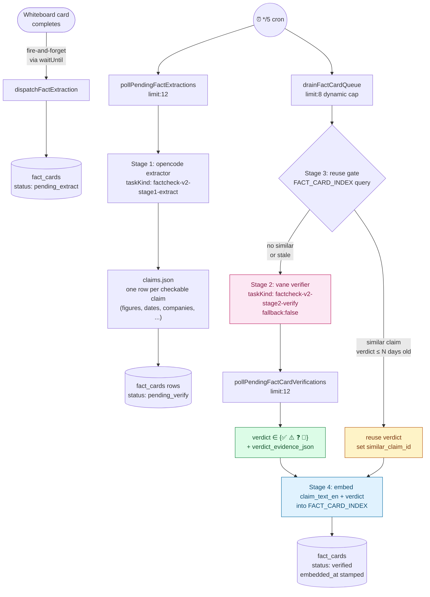

Stage 3 (the reuse gate) is the cost saver — querying FACT_CARD_INDEX is one Vectorize call (~30ms) vs. dispatching Stage 2 vane verification (multi-minute LLM call + web search). Hit rate is roughly 30% in steady state.

---

## 9. Bilingual layer (`worker/src/bilingual.ts`)

Three primitives:

### 9.1 `bilingual_pairs` table

One row per (session_id, basename). Tracks both halves of an EN ↔ ZH file pair:

```
pair_id, artifact_kind, parent_kind, parent_id, basename,
en_path, zh_path, en_r2_key, zh_r2_key, en_vector_id, zh_vector_id,
analyst_id, work_date, task_key, workflow_key, session_id,
source_label, created_at, updated_at
```

`recordBilingualPair()` is idempotent. `computePairId(session_id, basename)` returns a deterministic SHA-256 prefix so the embed pipeline and archive pipeline can agree on the pair_id without coordinating.

### 9.2 Pair detection (`detectPairsInFiles`)

Walks a workspace file list and collapses pairs by:

- Explicit: `<base>.en.<ext>` + `<base>.zh.<ext>`
- Implicit (legacy): `<base>.<ext>` + `<base>.en.<ext>` where `<ext>="md"` (legacy convention treats plain `.md` as the ZH half).

### 9.3 Vectorize dedup at query time (`dedupByPair`)

Similarity matches that share a `pairId` collapse to the highest-cosine entry per pair. Matches without `pairId` pass through. Used by the topic-similarity gate so a topic with both EN and ZH versions counts as ONE prior.

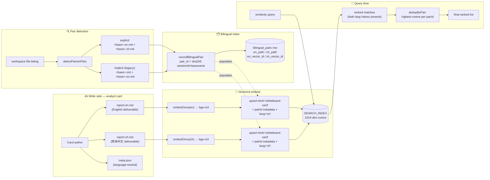

---

## 10. Mailbox (`worker/src/mailbox.ts`)

Threaded analyst-to-analyst messages with optional dispatch to agent-route.

### 10.1 Schema

```
mailbox_threads(thread_id, subject, status, participants_json,
                message_count, last_activity_at, created_at, ...)
mailbox_messages(message_id, thread_id, sender_analyst_id,
                 recipient_analyst_id, body, body_zh, body_en, kind,
                 status, attachments_json, metadata_json,
                 dispatch_status, dispatch_session_id,
                 created_at, ...)
```

### 10.2 Lifecycle

1. **Send** — analyst's workflow output emits a `follow_ups` JSON block (parsed by `auto-handoff.ts` post-run). Each entry creates a `mailbox_messages` row with `status='outbound'`.
2. **Dispatch** — the 5-min cron's `syncMailboxDispatches()` finds outbound messages, packages them as agent-route session messages or workflow runs (depending on metadata), records `dispatch_session_id`.
3. **Reply / Result** — the recipient analyst's run produces output. `pollMailboxInbox()` finalizes the message, attaches the result.

Content-hash dedup (`mailbox_messages.dedup_hash`) prevents duplicate dispatch when the same follow-up gets parsed from two different sources.

---

## 11. Archive + indexing (`worker/src/archive.ts`)

Mirrors agent-route activity into R2 + Vectorize so the institute's own search/UI never depends on the upstream's storage.

### 11.1 Two ingest paths

**`archiveExecutionOutput(env, { method, kind, ... })`** — one R2 JSON per institute-relevant API call:
- workflow launches (`archive_workflow_run`)
- session messages (`archive_session_message`)
- `/execute` and `/execute/stream`
- brain runs, multi-agent runs
- whiteboard card runs (`whiteboard-run`)

Keyed by `analyst_id`, `work_date` (Asia/Singapore via `currentWorkDate()`), `task_key`, `workflow_key`. R2 key shape: `sessions/{sessionId}/execution/{taskKey}/{ts}.json`.

**`archiveSessionWorkspace(env, sessionId, ...)`** — full workspace file snapshot. Fires on:
- terminal workflow statuses
- significant mutations (workspace upload, message append)
- whiteboard card finalization (per-card and per-board)

For each text file matching `TEXT_FILE_PATTERN` (`.md`, `.txt`, `.html`, `.json`, etc.):
1. Write to R2 at `sessions/{sessionId}/workspace/{path}`.
2. Embed via `@cf/baai/bge-m3`.
3. Upsert into `SEARCH_INDEX` with metadata `{ kind: "session-file", analyst_id, session_id, path, work_date, task_key, ... }`.
4. Index `archived_files` row in D1 for fast listing.

### 11.2 Fire-and-forget discipline

Archive work always goes through `c.executionCtx.waitUntil(...)`. Errors are swallowed after `noteSessionError(env, sessionId, err)` records them. Route handlers return quickly; long embeds don't block the user.

---

## 12. Brain task dispatcher (`worker/src/brain-task.ts`)

The single dispatcher every async LLM call goes through.

### 12.1 `dispatchBrainTask(env, sessionId, args)`

Args:
```ts
{
  agent: string,         // "claude" | "gemini" | "codex" | "opencode" | "vane" | "claude-api" | ...
  prompt: string,
  timeoutMs?: number,    // default BRAIN_TASK_TIMEOUT_MS = 30 min
  model?: string,        // hand-specific model override (e.g. "gemini-3.1-flash-lite-preview")
  fallback?: boolean,    // agent-route's cross-hand fallback (default true)
  taskKind?: string,     // ← NEW: forwarded as source: "institute:${taskKind}"
}
```

Calls upstream `POST /api/brain/{sessionId}/run?async=true`, returns `{ taskId, nodeId, status, pollUrl }`. The Worker never blocks on the LLM — the task ID is the handle for `pollBrainTask`.

### 12.2 `taskKind` plumbing (landed today)

Every dispatch site tags itself:

| Caller | `taskKind` |
|---|---|
| `opencode-extractor.ts:247` | `coordination-extract` |
| `fact-check.ts:424` | `factcheck-v1-card` |
| `fact-cards.ts:677` | `factcheck-v2-stage1-extract` |
| `fact-cards.ts:1318` | `factcheck-v2-stage2-verify` |
| `opencode-helper.ts:101` | `format-helper` |
| `whiteboard.ts:4369` | `whiteboard-visualization` |
| `whiteboard-handoff.ts` | `whiteboard-handoff` |
| `whiteboard-kickoff-fit.ts` | `whiteboard-kickoff-fit` |
| `runWhiteboardBrain` | inherits from caller |

Forwards as `source: "institute:${taskKind}"` to agent-route. Filterable upstream via `/api/tasks?source=institute:whiteboard-handoff`.

### 12.3 `runBrainWithFallback(env, sessionId, prompt, options)`

High-level wrapper for cases that want hand-rotation:

1. Random-pick from `candidateHands` (default = all edge hands).
2. Dispatch async, poll inline up to `inlinePollBudget` (default 35 polls × 3s).
3. If pending at budget exhaustion → return `{ kind: "pending", taskId }` (caller saves and the cron poller finalizes later).
4. If task fails with "no edge node" → retry with a different hand.
5. If all edge hands exhausted AND `allowApiFallback` → try matching API hand (`gemini-api`, etc.).
6. Otherwise return final classification.

`classifyBrainTask(task)` produces the unified result shape:
```ts
{ status, success, isTerminal, isWatchdogReaped, isNoEdgeNode,
  isQuotaExhausted, quotaResetMs, errorText, outputText, resultSummary, exitCode }
```

### 12.4 Hand normalization

Both `agent-route.ts` (Worker request body normalization) and `frontend/lib/api.ts` (frontend) collapse `*-api` aliases to the short form before sending. Downstream code assumes only short forms. The legacy long forms still exist in agent-route's vocabulary but the institute never emits them.

### 12.5 Full dispatcher topology

Every async LLM call in the Worker funnels through `dispatchBrainTask`. The `taskKind` field (added today) tags upstream `source` so `/api/tasks?source=institute:whiteboard-handoff` filters for one work type.

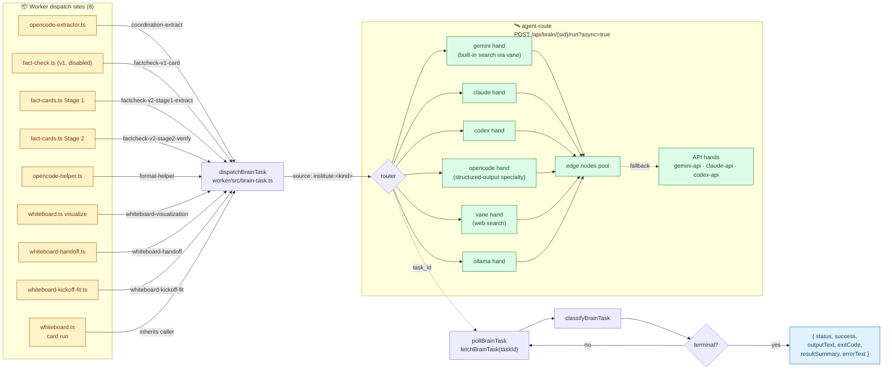

---

## 13. Analyst roster + eligibility (`worker/src/data.ts`)

### 13.1 Composition

The roster is composed from three sources at module load:

1. **`src/ai_institute/analysts/profiles.json`** — canonical (legacy Python heritage). 8 categories: macro, strategy, sectors, quant, risk, sentiment, fixed_income, thematic.
2. **`worker/src/runtime-overlays.json`** — overlay for additional categories (`synthesis` — editorial roles), `analyst_overrides` (per-analyst metadata like `whiteboard_role`), `task_templates`, `common_task_keys`, timezone.
3. **`worker/src/task-templates.json`** — task template catalog.

`ANALYST_CATEGORIES` is the merged tree; `analystIndex: Map<string, AnalystProfile>` is the flat lookup. `getAnalystById(id)` returns `{ id, name, name_en, specialty, specialty_en, agent, icon, tasks_default, whiteboard_role, category_id, ... }` or null.

### 13.2 `whiteboard_role` field

```
"primary"     ← macro / strategy / sector / equity-strategy. Default whiteboard pick.
"specialist"  ← narrow domain (quant / sentiment / fixed-income / credit / ESG / technical).
                Engage only when topic concretely sits in their domain.
"reviewer"    ← chief-risk, qa-manager, compliance-officer. Engage only on
                concrete fragility / compliance event / pre-publication audit.
"editorial"   ← synthesis category: morning-brief-editor, daily-report-editor,
                committee-chair, research-editor, qa-manager, institute-diagnostician,
                data-scientist, fact-checker. NOT eligible for whiteboard cards.
```

`listWhiteboardEligibleAnalysts()` filters to `whiteboard_role !== "editorial"`, sorted by `(role_priority, id)` for deterministic ordering. `buildWhiteboardCatalogBlock()` renders the eligible list as a markdown bullet list inlined into the kickoff and continuation prompts.

### 13.3 Workflow registration

`workflows/manifest.json` lists workflow shapes the Worker can sync into agent-route. `ensureWorkflowsRegistered(env)` lazy-bootstraps these into upstream on first `/api/workflows`, `/api/analysts*`, or workflow-run call. The mapping is recorded in the `institute_workflows` D1 table; subsequent calls are no-ops.

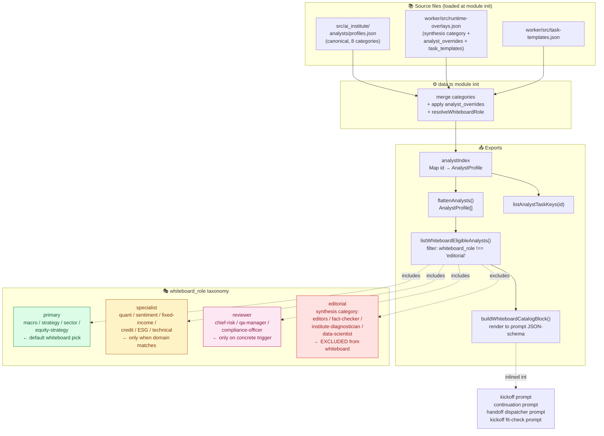

---

## 14. Frontend layers

### 14.1 `frontend/` — internal SPA

React 19 + Vite + Tailwind, deployed to Cloudflare Pages. Pages live in `frontend/app/<route>/page.tsx` (Next-style file naming, served by Vite via shims under `frontend/src/compat/`).

Notable pages:
- `page.tsx` — dashboard
- `whiteboard/page.tsx` — board list + per-board detail (3,500+ lines)
- `daily/page.tsx` — daily report editor
- `committee/page.tsx` — committee meeting workflow
- `research/page.tsx` — 12-stage SOP launcher
- `mailbox/page.tsx` — thread list
- `analysts/page.tsx` — roster + status
- `sessions/page.tsx` — session inspector
- `fact-check/page.tsx` + `compare/page.tsx`
- `admin/page.tsx` — API key management, kickoff promotion, similarity log

`frontend/lib/api.ts` is the unified data layer. Bilingual switching via `LanguageContext` (`pickLocale(zh, en, locale)` helper).

### 14.2 `frontend-readonly/` — public read-only UI

Smaller, separate React app on its own Pages site. Limited scopes (`whiteboard:read`, `reports:read`, `search:read`, `factcards:read`). User stores their key in localStorage; no first-party auth.

### 14.3 `/docs` — Scalar OpenAPI reference

Auto-generated from the `OpenAPIHono` route definitions in `worker/src/v1/index.ts`. New endpoints surface automatically.

---

## 15. Feature flag matrix

All flags live in `Env` interface (`worker/src/config.ts`). Toggle via `wrangler secret put NAME` (or wrangler.jsonc `vars` for non-secret).

| Flag | Values | Default | What it gates |
|---|---|---|---|
| `FACTCHECK_V1_DISABLED` | `"true"` / unset | `"true"` | Disables Fact-Check v1 enqueue + drain |
| `FACTCHECK_V2_SHADOW_MODE` | `"true"` / unset | `"true"` | Enables Fact-Check v2 dispatch + drain |
| `FACTCHECK_V2_DISPATCH_DISABLED` | `"true"` / unset | `"false"` | Halts v2 NEW dispatches (polling continues) |
| `WHITEBOARD_OPENCODE_HANDOFF` | `"true"` / `"shadow"` / `"false"` | `"true"` (live) | Opencode picks next analyst per card |
| `WHITEBOARD_OPENCODE_KICKOFF_FIT_CHECK` | `"true"` / `"shadow"` / `"false"` | `"true"` (live) | Opencode audits kickoff analyst-topic fit |
| `WHITEBOARD_INFLIGHT_SOFT_CAP` | int | `8` | Below: always kickoff |
| `WHITEBOARD_INFLIGHT_HARD_CAP` | int | `16` | At/above: skip (modulo force) |
| `WHITEBOARD_KICKOFF_FORCE_AFTER_HOURS` | float | `4` | Force kickoff after this gap |
| `V1_RATE_LIMIT_PER_MIN` | int | `60` | Per-key limit on /api/v1/* |
| `V1_RATE_LIMIT_ENFORCE` | `"true"` / unset | log-only | When true, over-cap returns 429 |
| `CORS_ORIGIN` | string | `"*"` | CORS allowlist |

`AGENT_ROUTE_API_KEY` is a secret (the only true secret); everything else is configuration.

```mermaid
graph TD
    subgraph Secrets["🔐 Secrets (wrangler secret)"]
        AR_KEY["AGENT_ROUTE_API_KEY<br/>(required)"]
        WH_OPENCODE["WHITEBOARD_OPENCODE_HANDOFF<br/>= true / shadow / false"]
        WH_FIT["WHITEBOARD_OPENCODE_KICKOFF_FIT_CHECK<br/>= true / shadow / false"]
    end

    subgraph Vars["📋 Vars (wrangler.jsonc)"]
        FC_V1["FACTCHECK_V1_DISABLED<br/>= true (current)"]
        FC_V2_SHADOW["FACTCHECK_V2_SHADOW_MODE<br/>= true (current)"]
        FC_V2_DISP["FACTCHECK_V2_DISPATCH_DISABLED<br/>= false (current)"]
    end

    subgraph EnvOptional["⚙️ Optional env tunables"]
        SOFT["WHITEBOARD_INFLIGHT_SOFT_CAP<br/>default 8"]
        HARD["WHITEBOARD_INFLIGHT_HARD_CAP<br/>default 16"]
        FORCE["WHITEBOARD_KICKOFF_FORCE_AFTER_HOURS<br/>default 4"]
        RL_PER["V1_RATE_LIMIT_PER_MIN<br/>default 60"]
        RL_ENF["V1_RATE_LIMIT_ENFORCE<br/>default log-only"]
        CORS["CORS_ORIGIN<br/>default *"]
    end

    subgraph Subsystems["📦 Subsystems gated by these flags"]
        WBKick["whiteboard kickoff<br/>(0,30 cron)"]:::wb
        WBHandoff["per-card handoff override"]:::wb
        WBFit["kickoff fit-check override"]:::wb
        FC1["Fact-Check v1 enqueue + drain"]:::fc
        FC2["Fact-Check v2<br/>Stage 1 + Stage 2 dispatch"]:::fc
        APIv1["/api/v1/* rate limit"]:::api
        AllUp["all upstream calls"]:::all
    end

    AR_KEY --> AllUp
    WH_OPENCODE -->|"true: live override<br/>shadow: log-only<br/>false: skip"| WBHandoff
    WH_FIT -->|"true / shadow / false"| WBFit
    FC_V1 -->|"true: disable v1 enqueue"| FC1
    FC_V2_SHADOW -->|"true: enable v2 dispatch + drain"| FC2
    FC_V2_DISP -->|"true: halt new dispatches<br/>(polling continues)"| FC2

    SOFT --> WBKick
    HARD --> WBKick
    FORCE --> WBKick

    RL_PER --> APIv1
    RL_ENF --> APIv1

    classDef sec fill:#fee2e2,stroke:#dc2626,color:#991b1b
    classDef var fill:#fef3c7,stroke:#b45309,color:#78350f
    classDef opt fill:#e0f2fe,stroke:#0284c7,color:#075985
    classDef wb fill:#dcfce7,stroke:#15803d,color:#14532d
    classDef fc fill:#fce7f3,stroke:#be185d,color:#831843
    classDef api fill:#ede9fe,stroke:#7c3aed,color:#5b21b6
    classDef all fill:#f1f5f9,stroke:#475569,color:#1e293b
    class AR_KEY,WH_OPENCODE,WH_FIT sec
    class FC_V1,FC_V2_SHADOW,FC_V2_DISP var
    class SOFT,HARD,FORCE,RL_PER,RL_ENF,CORS opt
```

---

## 16. Failure modes + recovery

### 16.1 Whiteboard card stuck `running`

Symptom: card has `status='running'` and `metadata.async_task_id` for hours.

Root cause hierarchy:
1. Upstream task genuinely still running — `pollPendingWhiteboardCards` waits indefinitely; `runningSince` clock starts when upstream flips to running.
2. Upstream task failed but reaped silently — caught when `tooOld = (Date.now() - runningSince) > BRAIN_TASK_TIMEOUT_MS + 10min` (40 min total).
3. Upstream task queued forever (no edge node) — `runningSince` never starts. **Currently never times out** — known gap, candidate for the queued-too-long fix discussed but deferred.

Recovery path: `pollPendingWhiteboardCards` reads workspace; if files exist, finalize the card from workspace contents (auto-recovery) regardless of upstream classification.

### 16.2 Whiteboard board stuck `active` with stale next pointer

Symptom: board has `status='active'`, `next_analyst_id` set, but no card progresses for hours.

Cause: 5-min cron's `tickWhiteboard` is throughput-bounded — one card-advance per tick. If the board waits behind 17 others all targeting card #2, each board waits ~5 min × position-in-queue.

Mitigation (landed today):
- Policy A back-pressure stops the bleed (no new boards above hard cap).
- Policy B picker preferentially advances near-done boards.

### 16.3 Workflow run pending forever

`pending_runs` table tracks runs the Worker dispatched but couldn't inline-poll to terminal. `syncManagedScheduledRuns` (5-min cron) reconciles by polling agent-route. Stale rows older than the cap are marked failed.

### 16.4 Lock leaks

`WHITEBOARD_LOCK_TTL_MS ≈ 130 min`. After this, `claimBoardLock`'s `locked_at < cutoff` clause lets the next tick steal the lock. Real risk: a tick that crashed mid-finalize loses ~2h before another tick recovers. Acceptable.

### 16.5 D1 schema drift

Migrations are append-only. Adding a column means a new migration. The `wrangler d1 migrations apply` step runs on each deploy; missing migrations are a deploy-blocking error.

---

## 17. The session-internal patterns that recur

Things that aren't on any single file but show up across the codebase:

### 17.1 `currentWorkDate(now?)`

Asia/Singapore date in `YYYY-MM-DD`. Used everywhere a "today" stamp is needed. Defined in `data.ts`. Never compute UTC dates inline; always go through this.

### 17.2 `dispatchBrainTask` + `pollBrainTask` + `classifyBrainTask`

Every async LLM call uses this triple. When adding a new LLM-driven feature, copy the pattern from `whiteboard-handoff.ts` or `opencode-extractor.ts` — don't reinvent.

### 17.3 Bilingual deliverables

Anything user-facing is bilingual: report files, summaries, theses, follow-up topics, follow-up questions. The pattern is `field` (ZH) + `field_en` (EN) sibling. The `i18n` slot in `metadata_json` carries the EN siblings for kickoff / next-up display so the UI can pick by locale.

### 17.4 `executionCtx.waitUntil` for long work

Archive embeds, fact-card extraction, opencode handoff, whiteboard visualization — all fire-and-forget. Errors swallowed after console.error. The route handler returns quickly.

### 17.5 Status tags as state machines

Every entity has a small status enum that's the single source of truth. Updates always go through a CAS-style UPDATE with the prior status in the WHERE clause when concurrency matters.

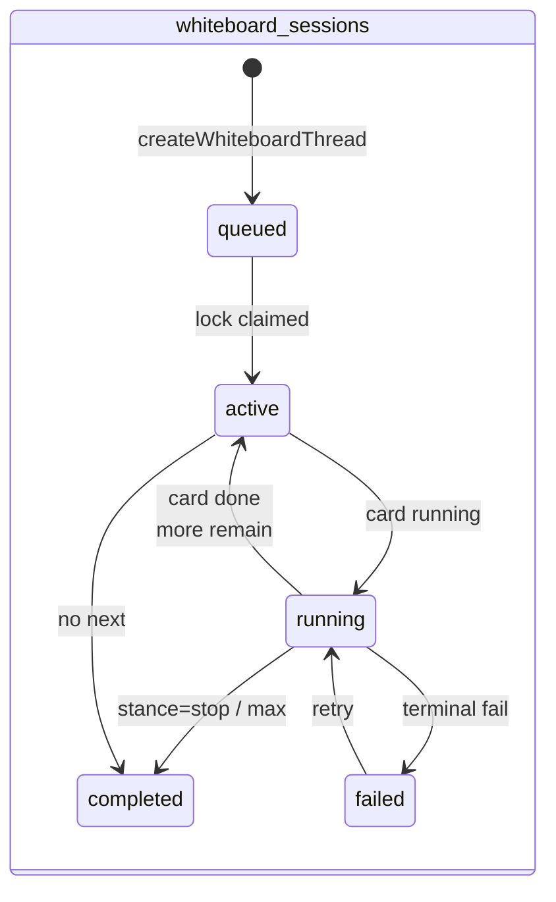

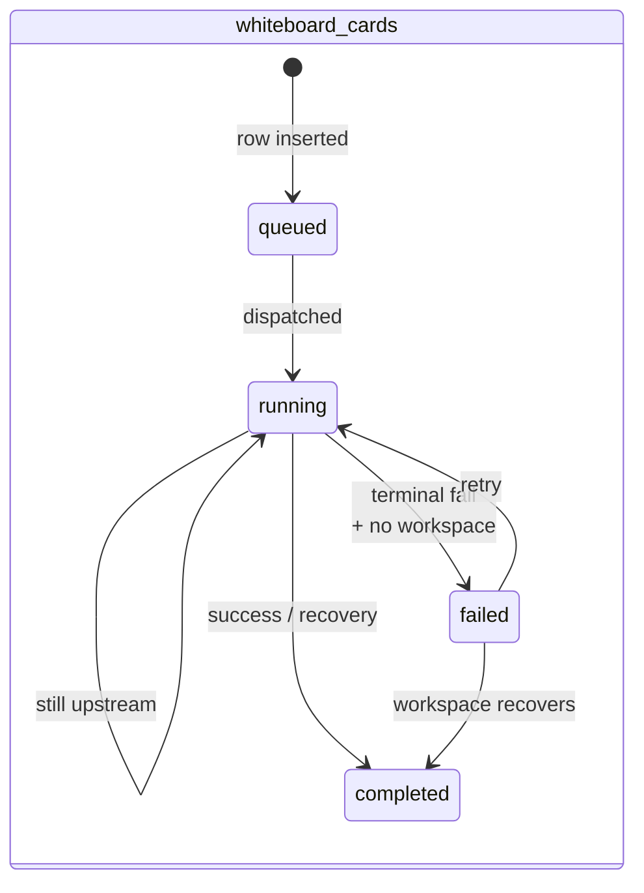

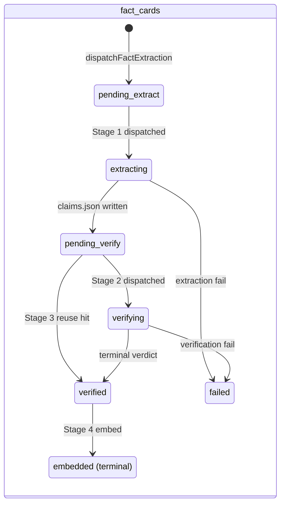

```mermaid
stateDiagram-v2
    direction LR
    state "mailbox_messages" as MM {
        [*] --> m_o: emit follow_up
        m_o: outbound
        m_o --> m_d: cron syncMailboxDispatches
        m_d: dispatched
        m_d --> m_pr: dispatch_session_id stamped
        m_pr: pending_reply
        m_pr --> m_c: pollMailboxInbox terminal
        m_c: completed
        m_o --> m_f: dispatch error
        m_pr --> m_f: upstream fail
        m_f: failed
    }
```

```mermaid
stateDiagram-v2
    direction LR
    state "whiteboard_topic_pool" as TP {
        [*] --> tp_c: ingestCandidate
        tp_c: candidate
        tp_c --> tp_p: pickDiverseKickoffTopic<br/>+ atomic claim
        tp_p: promoted
        tp_c --> tp_s: similarity skip-summarize
        tp_s: skipped
        tp_c --> tp_e: TTL expired (7d)
        tp_e: expired
    }
```

```mermaid
stateDiagram-v2
    direction LR
    state "pending_runs" as PR {
        [*] --> pr_p: workflow run dispatched
        pr_p: pending
        pr_p --> pr_p: cron poll (still running)
        pr_p --> pr_t: terminal status
        pr_t: terminal
        pr_t --> pr_a: archived
        pr_a: archived
    }
```

---

## 18. Future workstream — the graph layer (deferred)

Detailed proposal: `vibelog/graph-knowledge-proposal.md`.

In short: stage `temp/us_stock/` (244 US tickers + 115-company AI infra KG + 203 research markdowns) and `temp/graph_analysis/` (4,750 nodes across 61 chains + 6,903 edges) into three new D1 tables (`chain_nodes`, `chain_edges`, `node_aliases`) plus a many-to-many `artifact_mentions` table. Then:

- Hybrid retrieval (cosine + graph diffusion) on `/api/search`.
- Per-output entity tagging via gemini-flash-lite.
- Pre-seed kickoff prompts with chain context.
- Coverage-gap pool source.

Three phases, ~6.5 days of work total. Awaiting operator decision on Phase A start + the 9 open design questions in §13 of the proposal.

---

## 19. Today's monitoring

Live cron jobs (in this Claude session only):

- `f6388099` — every hour at `:17`, runs `/tmp/wb-monitor/snapshot.sh`, appends a JSONL record to `/tmp/wb-monitor/log.jsonl`.
- `3fd5bc09` — one-shot at `2026-05-06 22:03 SGT`, generates `vibelog/whiteboard-monitor-2026-05-06.md` from the accumulated log.

Snapshot fields: status distribution, inflight × card_count, completions/failures/new-inflight in last hour, count of cards stuck `running` > 4h, last kickoff timestamp.

---

## Appendix A — File-to-system map

| System | Primary files |
|---|---|
| Whiteboard pipeline | `worker/src/whiteboard.ts`, `whiteboard-handoff.ts`, `whiteboard-kickoff-fit.ts` |
| Topic seed pool | `worker/src/topic-seed-pool.ts` |
| Fact-Check v1 | `worker/src/fact-check.ts` (disabled) |
| Fact-Check v2 | `worker/src/fact-cards.ts` |
| Bilingual layer | `worker/src/bilingual.ts` |
| Mailbox | `worker/src/mailbox.ts`, `worker/src/auto-handoff.ts` |
| Archive + indexing | `worker/src/archive.ts`, `worker/src/vectorize.ts` |
| Brain dispatcher | `worker/src/brain-task.ts`, `worker/src/agent-route.ts` |
| Analyst roster | `worker/src/data.ts`, `worker/src/runtime-overlays.json`, `src/ai_institute/analysts/profiles.json` |
| Coordination extraction | `worker/src/opencode-extractor.ts`, `worker/src/opencode-helper.ts` |
| Workflow lifecycle | `worker/src/workflow-relaunch.ts` |
| Fleet health | `worker/src/fleet-health.ts` |
| Events log | `worker/src/events.ts` |
| API auth | `worker/src/api-keys.ts` |
| Request router | `worker/src/index.ts` |
| /api/v1 sub-app | `worker/src/v1/index.ts` |
| Config / env | `worker/src/config.ts` |
| Frontend (internal) | `frontend/app/*/page.tsx`, `frontend/lib/api.ts` |
| Frontend (readonly) | `frontend-readonly/src/api.ts`, `frontend-readonly/src/pages/*` |

## Appendix B — End-to-end timing for one whiteboard card

Approximate, from kickoff cron tick to next tick:

| Step | Wall clock | Notes |
|---|---|---|
| Kickoff cron fires | t = 0 | `0,30 * * * *` |
| `evaluateKickoffGate` | +20 ms | one D1 query |
| `pickDiverseKickoffTopic` (with similarity) | +2 s | top-K embed + Vectorize queries |
| `createWhiteboardThread` | +50 ms | one INSERT |
| `tickWhiteboard` first iteration | starts ~+2 s | |
| `claimBoardLock` | +30 ms | |
| `executeBoardCard` → `dispatchBrainTask` | +200 ms | async dispatch returns immediately |
| Inline poll budget exhausts | +5–10 min | usually pending after this |
| Lock released, card stays `running` | | next finalize via `pollPendingWhiteboardCards` |
| Upstream model finishes | +20–40 min | depends on hand + topic |
| Next 5-min cron's `pollPendingWhiteboardCards` | t + 25–45 min | |
| `extractCardDecision` | +20 ms | regex + JSON parse |
| `applyKickoffFitCheckOverride` (kickoff only) | +60–90 s | opencode dispatch + poll |
| `applyOpencodeHandoffOverride` | +60–90 s | opencode dispatch + poll |
| SQL UPDATE finalize | +50 ms | |
| Archive workspace + embed (waitUntil) | non-blocking | |
| Fact-Check v2 Stage 1 enqueue | non-blocking | drained on subsequent ticks |

End-to-end per card: **typically 30–50 minutes**. Per board (8–10 cards): 5–8 hours under healthy operation.

---

End of architecture reference. For the proposal docs that drove individual design choices, see `vibelog/`:

- `graph-knowledge-proposal.md` — future graph layer
- `whiteboard-vectorize-proposal.md` — similarity gate origin
- `operator-role-proposal.md`
- `bilingual-support-proposal.md` (if present, otherwise composed from session retros)

Last touched: 2026-05-06 by the assistant during a long bilingual / handoff / back-pressure session.
