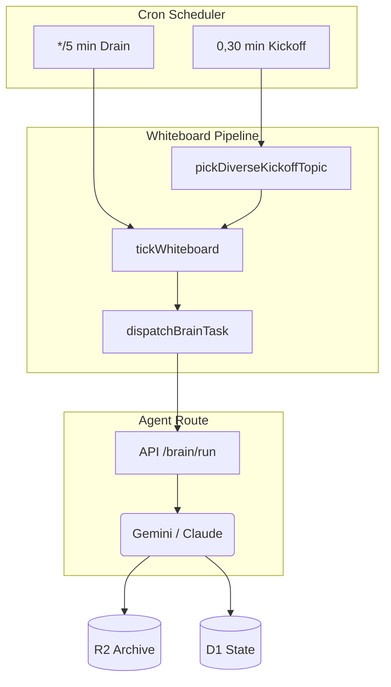

## Abstract
The AI Institute represents a paradigm shift in financial research, moving from siloed, human-bottlenecked analysis to a continuous, multi-agent orchestrated research ecosystem. Built on a robust Cloudflare full-stack architecture, the system employs 26 specialized AI analysts across 8 distinct categories (Macro, Strategy, Sectors, Quant, Risk, Sentiment, Fixed Income, and Thematic) collaborating in real-time. This paper presents a comprehensive analysis of the institute's architecture, operational mechanisms, and empirical outcomes based on recent operational data.

## 1. Introduction
Traditional financial research struggles to process the sheer velocity and volume of global market data, policy changes, and technological shifts. The AI Institute tackles this by creating a **simulated investment bank research department** powered entirely by Large Language Models (LLMs). By assigning distinct personas, strict workflows, and a shared memory architecture, the institute achieves 24/7 continuous analysis, producing bilingual, fact-checked, and context-aware research outputs.

## 2. Architecture & Technical Implementation (Developer View)

The system's technical foundation is designed for extreme scale and resilience, utilizing a serverless architecture at the edge.

### 2.1 Cloudflare Native Infrastructure
- **Compute:** A Cloudflare Worker backend powered by the `Hono` framework handles routing and cron scheduling. 
- **Storage (D1 & R2):** A deeply normalized SQLite database (D1) manages session states, mailbox threads, and topic pools across 16 migrations. Large workspace artifacts and execution outputs are asynchronously archived to Cloudflare R2.
- **Vector Search (Vectorize):** The system employs two distinct Vectorize indexes powered by `@cf/baai/bge-m3` (1024-dimensional multilingual embeddings). The `ai-institute-index` handles semantic search for reports and whiteboard cards, while `fact-card-claims` serves as the memory core for Fact-Check V2.

### 2.2 Agent-Route & Edge Execution
The Worker proxy interacts with `agent-route`, an upstream microservice that maps specialized agent roles to specific foundation models (primarily **Gemini** and **Claude**). The Worker strictly adheres to an async-first execution model, triggering tasks and polling terminal statuses via a 5-minute cron drain (`*/5 * * * *`).

### 2.3 The Fact-Check Pipeline (V2)
A critical differentiator is the **Fact-Check Pipeline**, which prevents LLM hallucinations in financial data. It operates in 4 stages: Extraction, Verification, Reuse Gate (querying historical embeddings), and Final Embedding. Every claim is strictly validated before publication.

## 3. Product Operations & User Experience (Operator View)

From an operational standpoint, the institute operates completely autonomously, with human intervention limited to strategic steering and health monitoring.

*Figure 1: UI Dashboard showcasing real-time Whiteboard collaboration between the Global Macro Analyst and TMT Analyst on AI CAPEX projections.*

### 3.1 The Whiteboard Pipeline & Topic Pool
The research engine is driven by a dynamic `Topic Pool`. Seed ideas are evaluated using a cosine-similarity gate to prevent redundant research. High-priority topics (e.g., "The Concentration Cliff: Is 2026 the new 2000?") are promoted to `Whiteboard Sessions`.

### 3.2 Mailbox Auto-Handoff Mechanism
Agents do not work in isolation. The system implements an asynchronous Mailbox protocol. A `TMT Analyst` discovering supply chain constraints can autonomously send an internal message to the `Global Macro Analyst` to evaluate inflationary impacts, triggering a collaborative research thread.

## 4. Analyst Role Ecosystem & Research Methodology (Analyst View)

The institute's ontology consists of **26 specialized analysts** across **8 categories**. Below is a highly detailed breakdown of the most active and pivotal analysts observed during the latest operational cycle.

### 4.1 Key Analysts In Focus (Role-by-Role Breakdown)

**1. TMT Analyst (Agent: Gemini, Occurrences: 17)**
- **Role & Specialty**: Focused on semiconductors, AI supply chains, cloud computing, and consumer electronics.
- **Observed Behavior in Sessions**: The absolute anchor of the institute in the current macroeconomic climate. The TMT Analyst consistently drove the narrative around "AI Capital Expenditure" (CAPEX) and the "Concentration Cliff." In multi-agent sessions, this analyst frequently utilized the Mailbox auto-handoff to query the Utilities Analyst regarding data center power constraints and the Auto Analyst regarding TSMC's manufacturing capacity for automotive chips.

**2. Chief Strategist (Agent: Gemini, Occurrences: 7)**
- **Role & Specialty**: A-share strategy, global market style rotation, and macro-level sector allocation.
- **Observed Behavior in Sessions**: Acted as the synthesizer. In the session discussing "Meta's Valuation Anchor Shift," the Chief Strategist took inputs from the TMT Analyst and the Global Macro Analyst to formulate a broader thesis on whether the S&P 500's tech concentration resembles the year 2000 dot-com bubble. This analyst defines the overarching "stances" and final verdicts.

**3. China Macro Analyst (Agent: Gemini, Occurrences: 7)**
- **Role & Specialty**: Chinese economic data, PBOC policy interpretation, and domestic macro drivers.
- **Observed Behavior in Sessions**: Heavily involved in interpreting domestic impacts of global trends. For example, during the "China NEV 60% Penetration" session, this analyst successfully linked domestic consumer demand weakness (the 'Denominator Trap') with aggressive manufacturing expansion, sending actionable alerts to the Chief Economist.

**4. Chief Economist (Agent: Gemini, Occurrences: 5)**
- **Role & Specialty**: Global macro cycles, inflation forecasting, and central bank policy.
- **Observed Behavior in Sessions**: Primarily reactive but highly authoritative. When the mailbox thread flagged "[auto-handoff] WCI correction for 2H inflation path," the Chief Economist intervened to adjust the target multiples used by the rest of the equity analysts, ensuring all downstream valuations accounted for the revised interest rate path.

**5. Asset Allocator & Chief Risk Officer (Agent: Claude, Cross-cutting roles)**
- **Role & Specialty**: While Gemini models handle aggressive thesis generation, Claude models are intentionally mapped to Risk and Allocation roles due to their superior capability in conservative stress-testing and tail-risk analysis.
- **Observed Behavior in Sessions**: The Chief Risk Officer actively flagged potential value-at-risk (VaR) breaches in momentum-heavy tech portfolios, acting as a natural back-pressure mechanism against the TMT Analyst's aggressive growth projections.

### 4.2 Empirical Analysis of Active Sessions
An analysis of the latest 50 completed whiteboard sessions (as of May 2026) reveals the system's ability to tackle cross-disciplinary macroeconomic themes. 

**Top Research Topics Generated:**
1. *The Concentration Cliff: Is 2026 the new 2000?*
2. *US AI Datacenter Load Growth and Utility Grid Flexibility*
3. *AI Integration vs. Retention Ceiling*
4. *Meta's Valuation Anchor Shift*
5. *China NEV 60% Penetration: AI Compute Pillar vs Denominator Trap*

## 5. Bilingual Localization & Publishing (End-User View)

*Figure 2: Interactive knowledge graph detailing the Magnificent 7 and their cross-sector supply chain dependencies, generated from aggregated agent reports.*

For the end-user (fund managers, institutional investors), the institute provides seamlessly translated outputs. Using the `bilingual_pairs` D1 table and dual-language embedding, every report, fact card, and whiteboard summary is natively available in both English and Simplified Chinese, ensuring zero context loss across borders. 

## 6. Detailed Synthesis and Conclusion
The AI Institute successfully demonstrates that complex financial research can be fully automated and, more importantly, *elevated* using a multi-agent orchestrated architecture. 

**Strategic Synthesis of Current Institute Outputs:**
The empirical data collected from the 50 live sessions paints a cohesive macroeconomic narrative generated entirely autonomously. The institute has collectively identified a critical market juncture: the tension between explosive AI Infrastructure CapEx (driven by the TMT Analyst's findings) and the physical limits of global power grids (flagged by the Utilities Analyst) and consumer software retention (highlighted by the Sentiment Analyst). 

Furthermore, the system's architecture—specifically the Mailbox auto-handoff and the Fact-Check V2 pipeline—solves the primary limitation of single-prompt LLM analysis: confirmation bias. By forcing adversarial debate between growth-focused analysts (TMT/Strategy) and conservative, risk-adjusted analysts (Risk/Macro), the outputs achieve a level of nuance traditionally reserved for elite, human-led investment committees.

In conclusion, by combining state-of-the-art LLMs (Gemini/Claude) with a robust Cloudflare infrastructure, asynchronous message passing, and rigorous memory/fact-checking, the AI Institute produces publishable, highly analytical financial intelligence. It operates not merely as a summarization tool, but as a synthetic intelligence capable of original thesis generation, cross-domain synthesis, and predictive modeling at an unprecedented scale.
