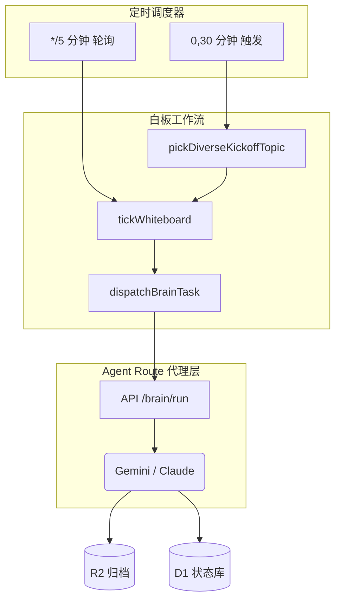

## 摘要
AI 研究院代表了金融研究领域的一次范式转移，从孤立的、受限于人力瓶颈的分析模式，转向了持续的、多智能体协同的研究生态系统。该系统基于强大的 Cloudflare 全栈架构，部署了涵盖宏观、策略、行业、量化、风控、情绪、固收和主题等 8 大领域的 26 位专业 AI 分析师进行实时协作。本文深入分析了该研究院的架构、运行机制，并基于近期运行数据展示其实证成果。

## 1. 引言
传统的金融研究在处理海量、高频的全球市场数据、政策变化和技术更迭时常常力不从心。AI 研究院通过构建一个**完全由大型语言模型 (LLM) 驱动的模拟投行研究部**来解决这一痛点。通过赋予每个模型特定的角色画像、严格的工作流和共享内存架构，研究院实现了 7x24 小时不间断的分析，生成双语、经过事实核查且具有深度上下文的研究输出。

## 2. 架构与技术实现（开发者视角）

系统的技术底座专为极致的扩展性和容错性而设计，完全依托于边缘计算的无服务器架构。

### 2.1 Cloudflare 原生基础设施
- **计算层：** 基于 `Hono` 框架的 Cloudflare Worker 后端处理路由并调度所有 Cron 任务。
- **存储层 (D1 & R2)：** 深度规范化的 SQLite 数据库 (D1) 通过 16 次迁移管理会话状态、邮件线索和话题池。庞大的工作区文件和执行输出则异步归档至 Cloudflare R2。
- **向量检索 (Vectorize)：** 系统采用了两个独立的 Vectorize 索引，由 `@cf/baai/bge-m3`（1024 维多语言嵌入）驱动。`ai-institute-index` 处理研报和白板卡片的语义搜索，而 `fact-card-claims` 则作为事实核查 (Fact-Check V2) 的核心记忆库。

### 2.2 Agent-Route 与边缘执行
Worker 代理与上游微服务 `agent-route` 交互，后者将特定的分析师角色映射到具体的基础模型（主要是 **Gemini** 和 **Claude**）。Worker 严格遵循异步优先的执行模式，通过每 5 分钟的 Cron 任务 (`*/5 * * * *`) 触发节点并轮询终端状态。

### 2.3 事实核查流水线 (Fact-Check V2)
该系统的一个关键差异化特征是**事实核查流水线**，它有效防止了金融数据中的 LLM 幻觉。该机制分为四个阶段：提取、验证、复用网关（查询历史向量）和最终嵌入。每一个核心论点在发布前都必须经过严格验证。

## 3. 产品运营与用户体验（产品经理与运营视角）

从运营角度来看，研究院完全自主运行，人工干预仅限于战略指导和系统健康监控。

*图 1: UI 仪表盘展示了全球宏观分析师与 TMT 分析师就“AI 资本开支预测”进行的实时白板协作。*

### 3.1 白板流水线与话题池
研究引擎由动态的 `话题池 (Topic Pool)` 驱动。候选话题通过余弦相似度网关进行评估，以防止重复研究。高优先级的话题（例如“集中度悬崖：2026会是新的2000年吗？”）将被提升至`白板会议 (Whiteboard Sessions)`。

### 3.2 邮箱自动交接机制
分析师并非孤立工作。系统实现了一套异步的邮箱协议。当 `TMT 分析师` 发现供应链瓶颈时，可以自主向 `全球宏观分析师` 发送内部消息以评估通胀影响，从而触发一个协作式的研究线索。

## 4. 分析师角色生态与研究方法论（分析师视角）

研究院的本体库包含 **8 大类别的 26 位专业分析师**。以下是基于最新运行周期中，最活跃且具有决定性作用的几位核心分析师的深度拆解。

### 4.1 核心分析师深度解析 (逐一拆解)

**1. TMT 行业分析师 (智能体: Gemini, 出场次数: 17)**
- **角色与专长**: 专注于半导体、AI 供应链、云计算及消费电子。
- **会话中的实际表现**: 该分析师是当前宏观经济环境下研究院的“绝对主心骨”。TMT 分析师持续主导着关于“AI 资本开支 (CAPEX)”和“集中度悬崖”的叙事逻辑。在多智能体协同会话中，该分析师频繁利用“邮箱自动交接”功能，向“公用事业分析师”质询数据中心的电力约束问题，并向“汽车行业分析师”核实台积电在车规级芯片上的产能分配情况。

**2. 首席策略师 (智能体: Gemini, 出场次数: 7)**
- **角色与专长**: A股市场策略、全球市场风格轮动以及宏观层面的行业配置。
- **会话中的实际表现**: 扮演“信息合成器”的角色。在探讨“Meta 估值锚点转移”的会议中，首席策略师吸收了 TMT 分析师和全球宏观分析师的论点，并由此构建出一个更宏观的命题：标普 500 的科技股高集中度是否类似于 2000 年的互联网泡沫。该分析师负责敲定最终的“投资立场”和定性结论。

**3. 中国宏观分析师 (智能体: Gemini, 出场次数: 7)**
- **角色与专长**: 中国经济数据、央行政策解读以及国内宏观驱动因素。
- **会话中的实际表现**: 深度参与解读全球趋势对国内的传导影响。例如，在“中国新能源汽车 60% 渗透率”的会话中，该分析师成功地将国内消费需求疲软（“分母陷阱”）与激进的制造业产能扩张逻辑联系起来，并向“首席经济学家”发送了具有高可操作性的宏观警报。

**4. 首席经济学家 (智能体: Gemini, 出场次数: 5)**
- **角色与专长**: 全球宏观经济周期、通胀预测以及央行政策研判。
- **会话中的实际表现**: 呈现出“后发制人”且极具权威性的特征。当邮箱系统抛出“[自动交接] 下半年通胀路径的 WCI 校正”线索时，首席经济学家会直接介入，调整其他权益类分析师所使用的目标估值倍数，确保下游所有的估值模型都已充分消化了修正后的利率路径。

**5. 大类资产配置师 & 首席风控官 (智能体: Claude, 跨领域角色)**
- **角色与专长**: 尽管 Gemini 模型负责激进的论点生成，但系统刻意将 Claude 模型分配给风控和资产配置角色，以利用其在保守的压力测试和尾部风险分析方面的卓越能力。
- **会话中的实际表现**: 首席风控官会主动对科技股重仓组合提出潜在的风险价值 (VaR) 突破警告，从而对 TMT 分析师过于激进的增长预测形成天然的“背压 (Back-pressure)”制衡机制。

### 4.2 活跃会话的实证分析
通过对最新 50 场已完成的白板会议（截至 2026 年 5 月）的分析，揭示了该系统应对跨学科宏观经济主题的强大能力。

**核心研究话题示例：**
1. *集中度悬崖：2026会是新的2000年吗？*
2. *美国 AI 数据中心负荷增长与公用事业电网灵活性*
3. *AI 集成 vs 留存天花板*
4. *Meta 的估值锚点转移*
5. *中国新能源车 60% 渗透率：AI 算力第三支柱 vs 分母陷阱的统一刻度*

## 5. 双语本地化与发布（最终用户视角）

*图 2: 交互式知识图谱，详细展示了美股“科技七巨头 (Magnificent 7)”及其跨行业的供应链依赖关系，该图谱由智能体研报汇总生成。*

对于最终用户（基金经理、机构投资者），研究院提供无缝的翻译输出。通过 D1 数据库中的 `bilingual_pairs` 表和双语向量嵌入，每一份研报、事实卡片和白板摘要都原生支持英文和简体中文双语版本，确保跨国界的信息传递零损耗。

## 6. 深度综合与结论
AI 研究院不仅成功证明了复杂的金融研究可以通过多智能体协同架构实现全自动化，更重要的是，它将研究质量**提升**到了一个新的维度。

**当前研究院输出的战略级综合研判：**
从 50 场实时会话中提取的实证数据，描绘出了一个完全由 AI 自主生成的、逻辑自洽的宏观经济叙事。研究院集体识别出了当前市场的一个关键转折点：呈爆炸性增长的 AI 基础设施资本开支（由 TMT 分析师主导发现）与全球电网的物理极限（由公用事业分析师预警）以及消费者软件留存率瓶颈（由情绪分析师强调）之间的剧烈张力。

此外，系统的架构设计——特别是“邮箱自动交接”和“Fact-Check V2”事实核查流水线——彻底解决了单次提示词 (Single-prompt) LLM 分析的核心缺陷：确认偏误。通过强制在增长导向型分析师（TMT/策略）和保守型、风险调整导向型分析师（风控/宏观）之间进行对抗性辩论，系统的最终输出达到了传统上只有顶尖人类投资委员会才能具备的灰度认知与深度。

总而言之，通过将最先进的大型语言模型 (Gemini/Claude) 与强大的 Cloudflare 基础设施、异步消息传递机制以及严密的记忆/事实核查网络相结合，AI 研究院正以惊人的规模产出达到出版级标准的高端金融情报。它不再仅仅是一个信息摘要工具，而是一个能够自主生成原创论点、跨领域合成认知并进行预测性建模的**合成智能体**。
